# Mobile App Overview

## Introduction

The papermemes.fun mobile app provides a seamless trading and learning experience on iOS and Android platforms, featuring real-time market data, paper trading, and meme-enhanced education.

## App Architecture

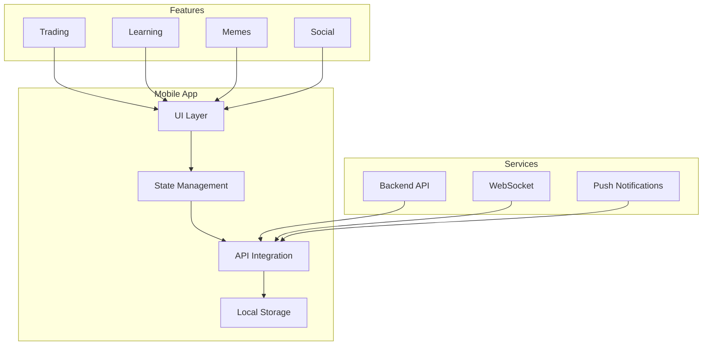

## Core Features

### 1. Trading Interface
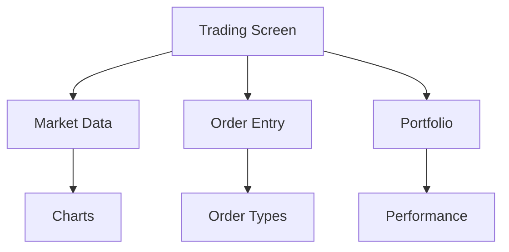

### 2. Learning System
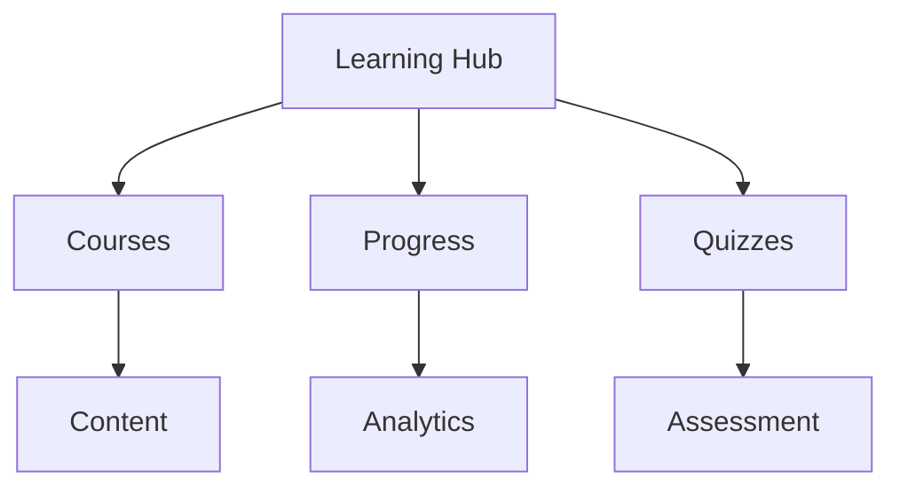

## User Flows

### Trading Flow
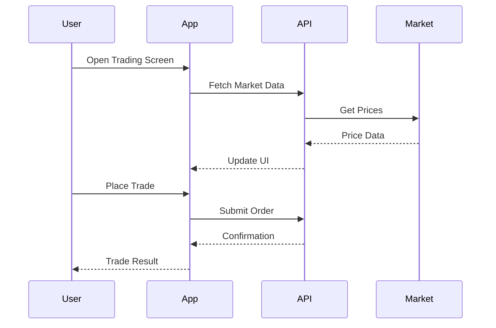

### Learning Flow
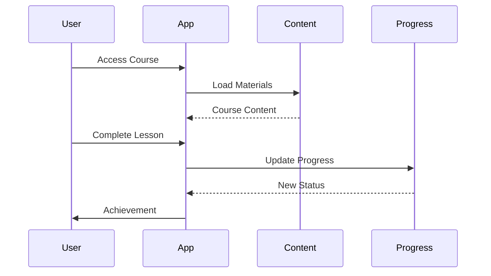

## Technical Architecture

### 1. Frontend Stack
- React Native
- TypeScript
- Redux/MobX
- React Navigation

### 2. Native Features
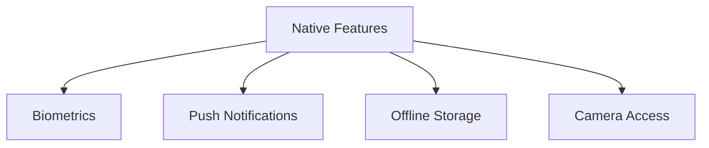

## Data Management

### 1. State Flow
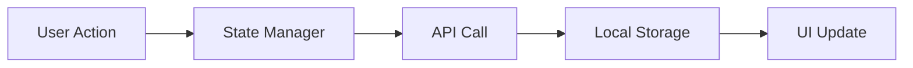

### 2. Caching Strategy
- Offline first approach
- Local data persistence
- Sync management
- Cache invalidation

## UI/UX Design

### 1. Navigation Structure
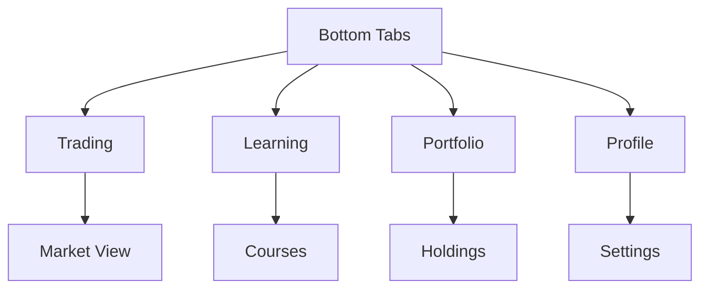

### 2. Design System
- Consistent typography
- Color schemes
- Component library
- Animation system

## Performance

### 1. Optimization
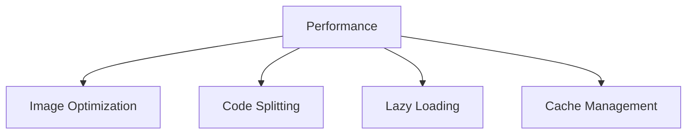

### 2. Metrics
- Launch time
- Frame rate
- Memory usage
- Network efficiency

## Security

### 1. Mobile Security
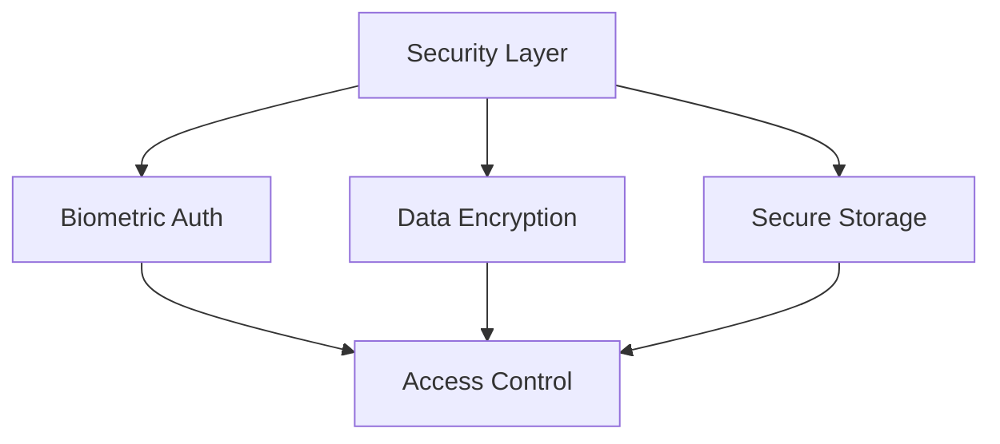

### 2. Features
- Secure storage
- Certificate pinning
- Code obfuscation
- Jailbreak detection

## Offline Capabilities

### 1. Offline Mode
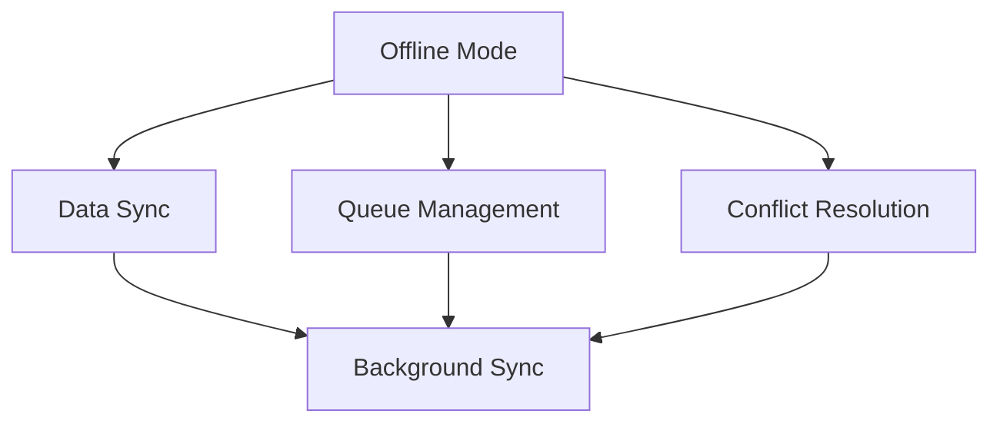

### 2. Features
- Offline trading
- Content caching
- Background sync
- Conflict resolution

## Push Notifications

### 1. Notification System
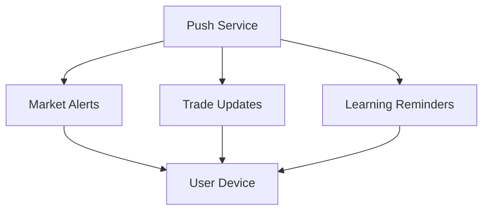

### 2. Categories
- Price alerts
- Trade notifications
- Learning reminders
- Social updates

## Analytics

### 1. Tracking System
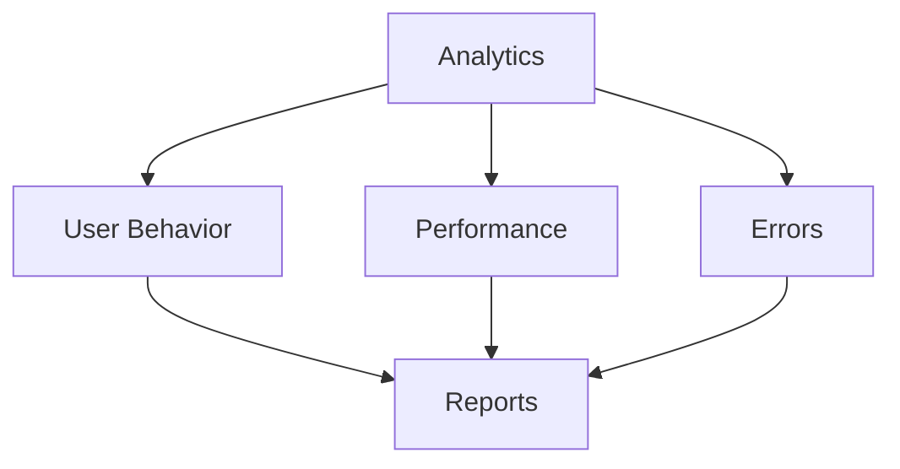

### 2. Metrics
- User engagement
- Feature usage
- Error tracking
- Performance data

## Testing Strategy

### 1. Testing Framework
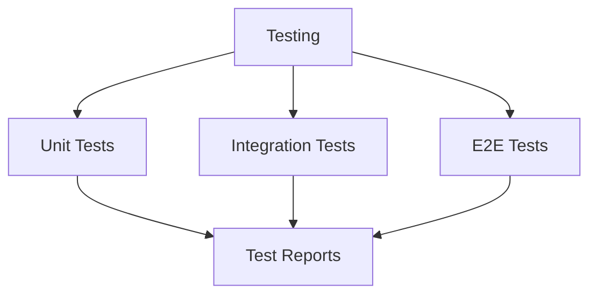

### 2. Coverage
- Component testing
- Integration testing
- E2E testing
- Performance testing

## Deployment

### 1. Release Process
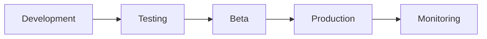

### 2. Platforms
- App Store
- Google Play
- Beta channels
- Testing distribution

## Future Roadmap

### 1. Planned Features
- Advanced charting
- Social trading
- AI assistance
- AR/VR integration

### 2. Improvements
- Performance optimization
- UI/UX enhancements
- Feature expansion
- Platform support 