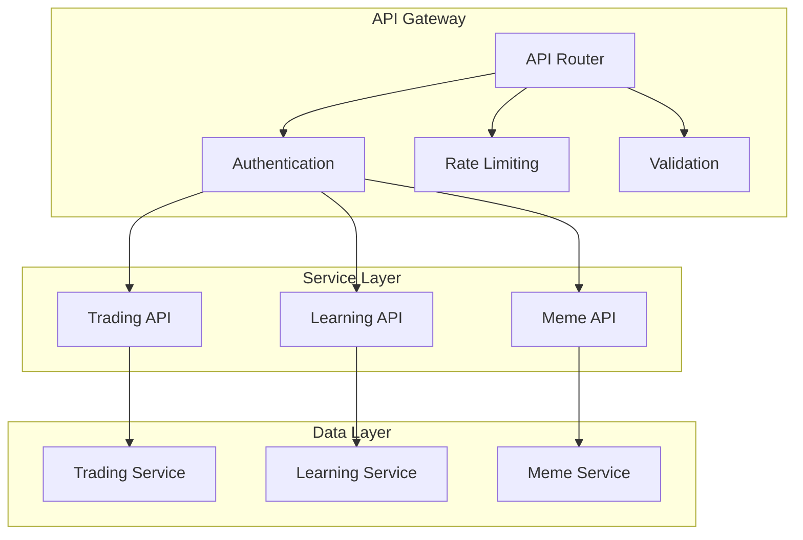
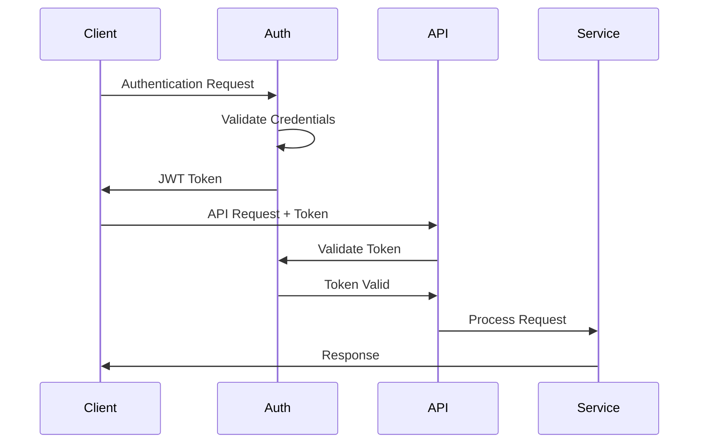
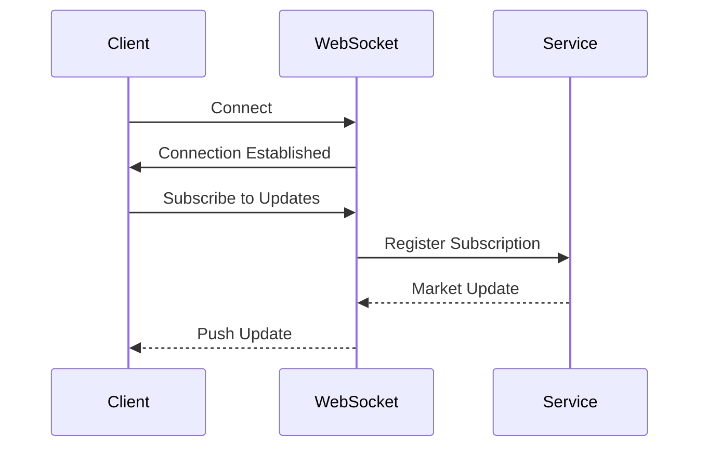
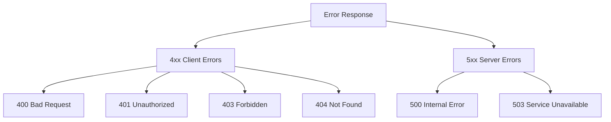
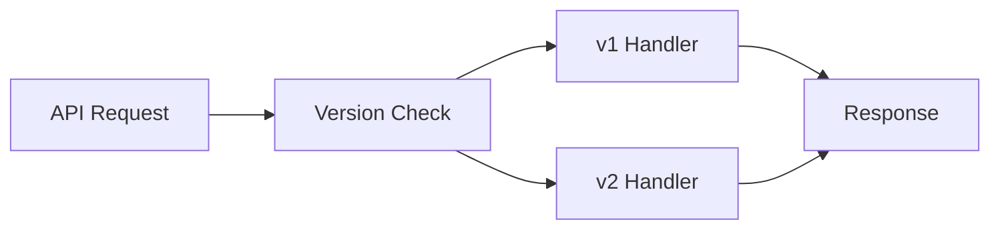

# API Reference

## Overview

The papermemes.fun API provides comprehensive endpoints for trading, learning, and meme generation functionalities.

## API Architecture



## Authentication

### 1. Authentication Flow


### 2. Authentication Endpoints

#### Login
```http
POST /api/auth/login
Content-Type: application/json

{
    "email": "user@example.com",
    "password": "secure_password"
}
```

Response:
```json
{
    "token": "jwt_token",
    "user": {
        "id": "user_id",
        "email": "user@example.com",
        "name": "User Name"
    }
}
```

## Trading API

### 1. Market Data

#### Get Market Price
```http
GET /api/market/price/{symbol}
Authorization: Bearer {token}
```

Response:
```json
{
    "symbol": "BTC/USD",
    "price": 50000.00,
    "timestamp": "2024-01-20T12:00:00Z",
    "change": 2.5
}
```

### 2. Trading Operations

#### Place Order
```http
POST /api/trading/order
Content-Type: application/json
Authorization: Bearer {token}

{
    "symbol": "BTC/USD",
    "type": "MARKET",
    "side": "BUY",
    "quantity": 1.0
}
```

Response:
```json
{
    "orderId": "order_123",
    "status": "FILLED",
    "price": 50000.00,
    "quantity": 1.0,
    "timestamp": "2024-01-20T12:00:00Z"
}
```

## Learning API

### 1. Course Management

#### Get Courses
```http
GET /api/learning/courses
Authorization: Bearer {token}
```

Response:
```json
{
    "courses": [
        {
            "id": "course_1",
            "title": "Trading Basics",
            "description": "Learn the basics of trading",
            "progress": 60
        }
    ]
}
```

### 2. Progress Tracking

#### Update Progress
```http
POST /api/learning/progress
Content-Type: application/json
Authorization: Bearer {token}

{
    "courseId": "course_1",
    "lessonId": "lesson_1",
    "completed": true
}
```

## Meme API

### 1. Meme Generation

#### Generate Meme
```http
POST /api/memes/generate
Content-Type: application/json
Authorization: Bearer {token}

{
    "context": "trading_success",
    "text": "When your trade hits the moon"
}
```

Response:
```json
{
    "memeId": "meme_123",
    "url": "https://papermemes.fun/memes/123.jpg",
    "timestamp": "2024-01-20T12:00:00Z"
}
```

## WebSocket API

### 1. Connection Flow


### 2. Subscription Example
```javascript
// Connect to WebSocket
const ws = new WebSocket('wss://papermemes.fun/ws');

// Subscribe to market data
ws.send(JSON.stringify({
    type: 'subscribe',
    channel: 'market',
    symbols: ['BTC/USD']
}));

// Handle updates
ws.onmessage = (event) => {
    const data = JSON.parse(event.data);
    console.log('Market Update:', data);
};
```

## Error Handling

### 1. Error Codes


### 2. Error Response Format
```json
{
    "error": {
        "code": "ERROR_CODE",
        "message": "Error description",
        "details": {
            "field": "Additional information"
        }
    }
}
```

## Rate Limiting

### 1. Limits
- Authentication: 5 requests per minute
- Trading: 60 requests per minute
- Market Data: 120 requests per minute
- Meme Generation: 30 requests per minute

### 2. Headers
```http
X-RateLimit-Limit: 60
X-RateLimit-Remaining: 58
X-RateLimit-Reset: 1579521600
```

## API Versioning

### 1. Version Control


### 2. Version Headers
```http
Accept: application/json
API-Version: v1
```

## Data Models

### 1. User Model
```json
{
    "id": "string",
    "email": "string",
    "name": "string",
    "created_at": "datetime",
    "settings": {
        "theme": "string",
        "notifications": "boolean"
    }
}
```

### 2. Order Model
```json
{
    "id": "string",
    "user_id": "string",
    "symbol": "string",
    "type": "string",
    "side": "string",
    "quantity": "number",
    "price": "number",
    "status": "string",
    "created_at": "datetime"
}
```

## Testing

### 1. Test Environment
- Base URL: `https://api-test.papermemes.fun`
- Test Credentials Available
- Sandbox Trading Environment

### 2. Example Test
```javascript
const response = await fetch('https://api-test.papermemes.fun/api/market/price/BTC-USD', {
    headers: {
        'Authorization': 'Bearer test_token'
    }
});
```

## SDK Examples

### 1. JavaScript
```javascript
const papermemes = require('papermemes-sdk');

const client = new papermemes.Client({
    apiKey: 'your_api_key'
});

// Place order
const order = await client.trading.placeOrder({
    symbol: 'BTC/USD',
    type: 'MARKET',
    side: 'BUY',
    quantity: 1.0
});
```

### 2. Python
```python
from papermemes_sdk import Client

client = Client(api_key='your_api_key')

# Get market price
price = client.market.get_price('BTC/USD')
``` 