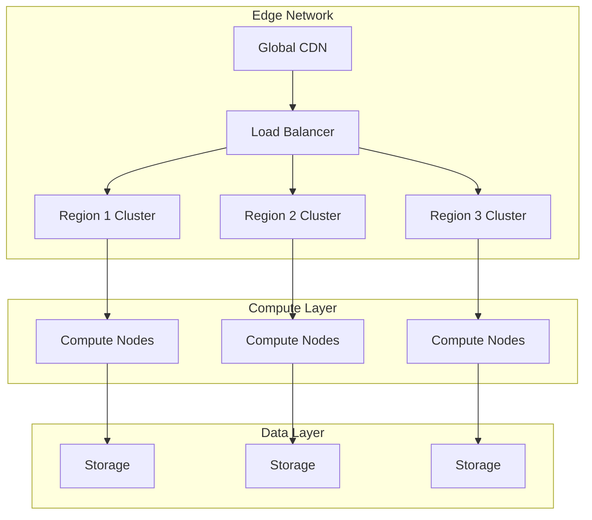
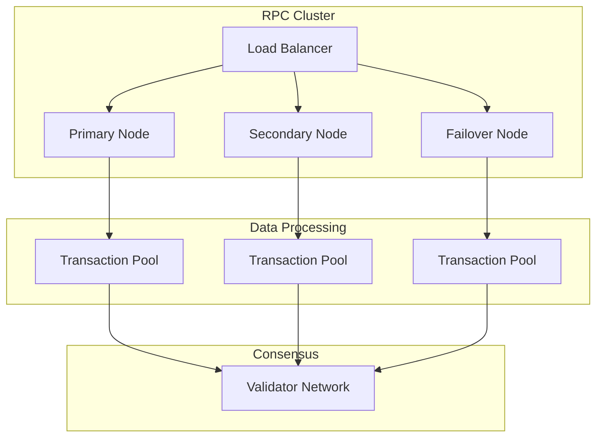
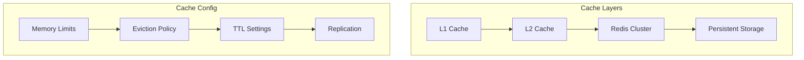
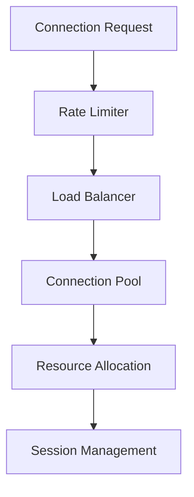
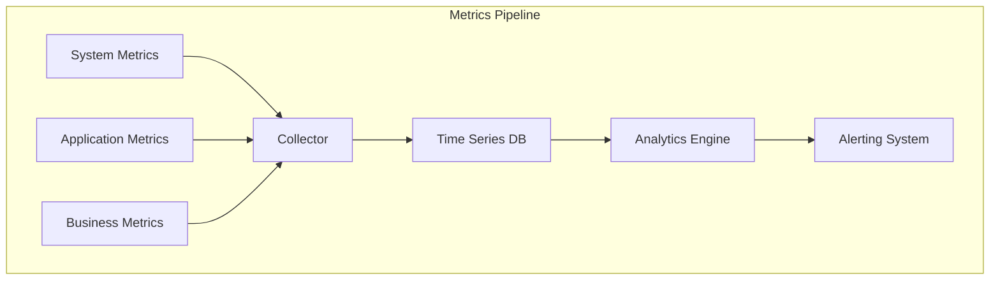

# Technical Implementation Details

## Core System Specifications

### 1. Network Infrastructure


### 2. Hardware Specifications
- **Edge Nodes**:
  - CPU: AMD EPYC 7763 (64-core/128-thread)
  - RAM: 512GB ECC DDR4-3200
  - Storage: 2TB NVMe SSD (Read: 7000MB/s, Write: 5300MB/s)
  - Network: 100Gbps fiber connection

- **Compute Nodes**:
  - CPU: Intel Xeon Platinum 8380 (40-core/80-thread)
  - RAM: 1TB ECC DDR4-3200
  - Storage: 8TB NVMe RAID 10
  - GPU: NVIDIA A100 (80GB variant)

## RPC Node Configuration

### 1. Node Architecture


### 2. Performance Parameters
```typescript
interface RPCConfig {
    maxConnections: 10000,
    connectionTimeout: 30000, // ms
    maxBatchSize: 100,
    maxConcurrentRequests: 5000,
    rateLimitWindow: 60000, // ms
    maxRequestsPerWindow: 100000,
    websocketHeartbeat: 30000, // ms
    maxSubscriptionsPerClient: 1000
}
```

## AI Model Architecture

### 1. Neural Network Configuration
```python
class DeepLearningConfig:
    def __init__(self):
        self.architecture = {
            'input_layer': {
                'neurons': 512,
                'activation': 'relu',
                'dropout': 0.2
            },
            'lstm_layers': [{
                'units': 256,
                'return_sequences': True,
                'stateful': True,
                'recurrent_dropout': 0.1
            }, {
                'units': 128,
                'return_sequences': False
            }],
            'dense_layers': [{
                'units': 64,
                'activation': 'relu',
                'kernel_regularizer': 'l2'
            }],
            'output_layer': {
                'units': 3,  # Buy, Sell, Hold
                'activation': 'softmax'
            }
        }
        self.training_params = {
            'batch_size': 32,
            'epochs': 100,
            'validation_split': 0.2,
            'learning_rate': 0.001,
            'optimizer': 'adam',
            'loss': 'categorical_crossentropy'
        }
```

### 2. Feature Engineering Pipeline
```python
class FeatureProcessor:
    def __init__(self):
        self.technical_indicators = {
            'moving_averages': [
                {'type': 'EMA', 'periods': [9, 21, 50, 200]},
                {'type': 'SMA', 'periods': [10, 20, 50, 100]}
            ],
            'oscillators': [
                {'type': 'RSI', 'period': 14},
                {'type': 'MACD', 'params': [12, 26, 9]},
                {'type': 'Stochastic', 'params': [14, 3, 3]}
            ],
            'volatility': [
                {'type': 'Bollinger', 'period': 20, 'std_dev': 2},
                {'type': 'ATR', 'period': 14}
            ]
        }
        self.feature_scaling = {
            'price': 'min_max',
            'volume': 'standard',
            'indicators': 'robust'
        }
```

## Transaction Processing Engine

### 1. Order Matching Algorithm
```typescript
interface OrderBook {
    bids: PriceLevel[];
    asks: PriceLevel[];
}

interface PriceLevel {
    price: number;
    orders: Order[];
    totalVolume: number;
}

class MatchingEngine {
    private orderBook: OrderBook;
    private matchingParams: {
        maxSlippage: number;
        minOrderSize: number;
        maxOrderSize: number;
        priceDecimals: number;
        volumeDecimals: number;
    };

    async matchOrder(order: Order): Promise<MatchResult> {
        const matches = this.findMatches(order);
        const execution = await this.executeMatches(matches);
        return this.validateAndConfirm(execution);
    }
}
```

### 2. Performance Optimizations
```typescript
interface PerformanceConfig {
    orderBookDepth: 1000;
    maxOrdersPerLevel: 100;
    priceTickSize: 0.00001;
    volumePrecision: 8;
    maxOpenOrders: 10000;
    orderExpirationTime: 86400; // seconds
    matchingEngineThreads: 4;
    batchProcessingSize: 100;
}
```

## Memory Management

### 1. Cache Architecture


### 2. Cache Configuration
```typescript
interface CacheConfig {
    l1Cache: {
        size: '32GB',
        algorithm: 'LRU',
        ttl: 60, // seconds
        maxKeys: 1000000
    },
    l2Cache: {
        size: '256GB',
        algorithm: 'LFU',
        ttl: 3600, // seconds
        maxKeys: 10000000
    },
    redisCluster: {
        nodes: 6,
        shards: 3,
        replication: 2,
        maxMemory: '512GB',
        evictionPolicy: 'volatile-lru'
    }
}
```

## Network Optimization

### 1. Protocol Configuration
```typescript
interface NetworkConfig {
    tcp: {
        keepAlive: true,
        keepAliveInitialDelay: 60000,
        noDelay: true,
        windowSize: 65536,
        congestionControl: 'cubic'
    },
    websocket: {
        compression: true,
        maxPayloadSize: 1048576,
        fragmentationThreshold: 16384,
        heartbeatInterval: 30000
    },
    http2: {
        maxConcurrentStreams: 1000,
        initialWindowSize: 65535,
        maxHeaderListSize: 8192,
        enablePush: true
    }
}
```

### 2. Connection Management


## Data Processing Pipeline

### 1. Stream Processing
```typescript
interface StreamConfig {
    batchSize: 1000,
    windowSize: 60000, // ms
    watermark: 5000, // ms
    checkpointInterval: 30000, // ms
    parallelism: 8,
    bufferTimeout: 100, // ms
    maxOutOfOrderness: 5000 // ms
}

class StreamProcessor {
    async processEvent(event: Event): Promise<void> {
        await this.preprocess(event);
        await this.enrichData(event);
        await this.aggregate(event);
        await this.analyze(event);
        await this.store(event);
    }
}
```

### 2. Batch Processing
```python
class BatchProcessor:
    def __init__(self):
        self.config = {
            'batch_size': 10000,
            'processing_threads': 16,
            'memory_limit': '64GB',
            'timeout': 300,  # seconds
            'retry_attempts': 3,
            'checkpoint_frequency': 1000
        }
        
    async def process_batch(self, data: List[Event]):
        partitioned_data = self.partition_data(data)
        processed_data = await self.parallel_process(partitioned_data)
        validated_data = self.validate_results(processed_data)
        return self.store_results(validated_data)
```

## System Monitoring

### 1. Metrics Collection


### 2. Performance Tracking
```typescript
interface MetricsConfig {
    collection: {
        interval: 10, // seconds
        retention: 90, // days
        resolution: 1, // second
        aggregation: '1m,5m,1h,1d'
    },
    alerts: {
        latencyThreshold: 100, // ms
        errorRateThreshold: 0.001, // 0.1%
        resourceUtilizationThreshold: 0.8, // 80%
        responseTimeThreshold: 200 // ms
    }
} 