# AI Integration

## Overview

papermemes.fun leverages advanced AI technologies to enhance trading education, provide market analysis, and generate engaging meme content.

## AI Architecture

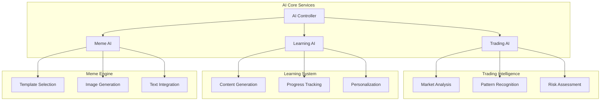

## AI Components

### 1. Trading AI System
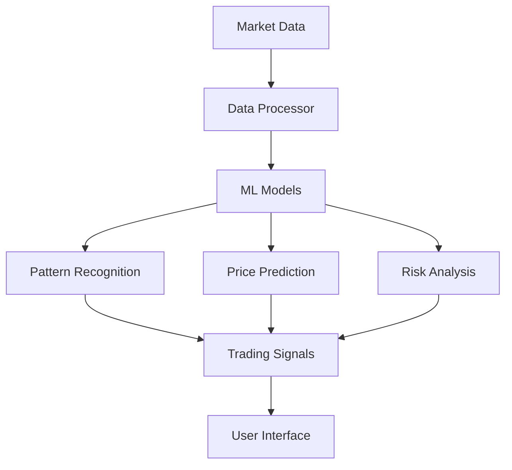

### 2. Learning AI System
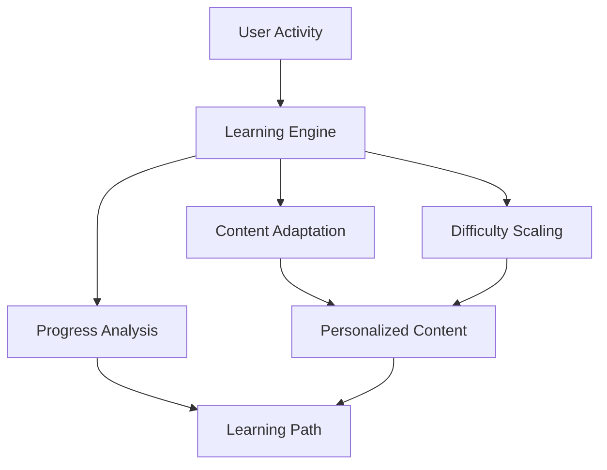

### 3. Meme Generation System
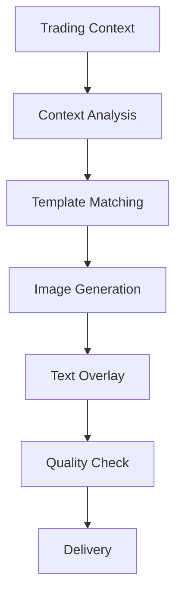

## AI Processing Flows

### Trading Analysis Flow
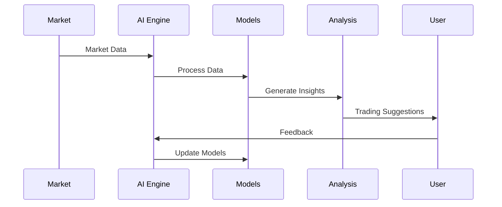

### Learning Adaptation Flow
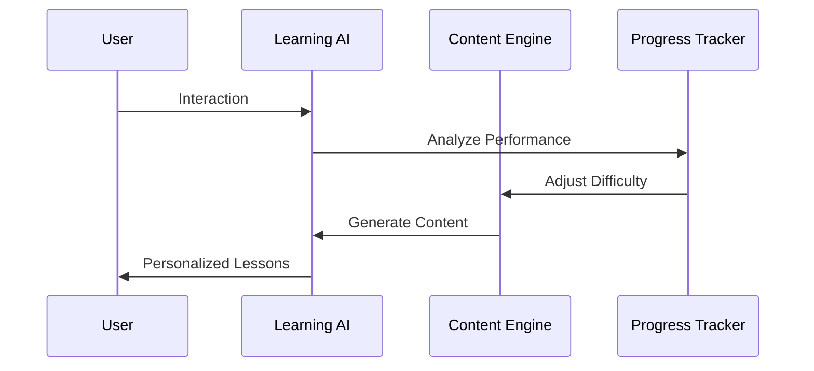

## AI Features

### 1. Trading Intelligence
- **Market Analysis**
  - Price trend prediction
  - Volume analysis
  - Pattern recognition
  - Risk assessment

- **Trading Suggestions**
  - Entry/exit points
  - Position sizing
  - Risk management
  - Portfolio optimization

### 2. Learning System
- **Content Personalization**
  - Adaptive difficulty
  - Custom learning paths
  - Progress tracking
  - Performance analysis

- **Interactive Learning**
  - Real-time feedback
  - Guided practice
  - Knowledge testing
  - Skill assessment

### 3. Meme Generation
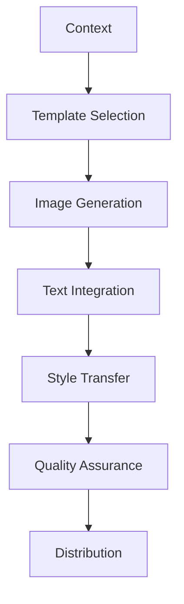

## AI Models

### 1. Trading Models
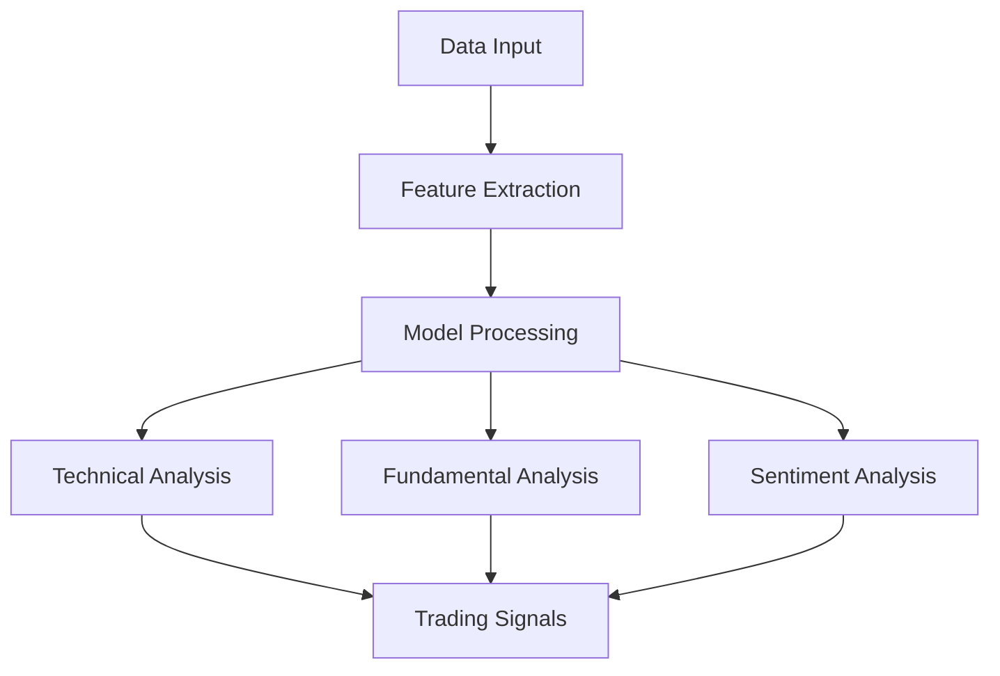

### 2. Learning Models
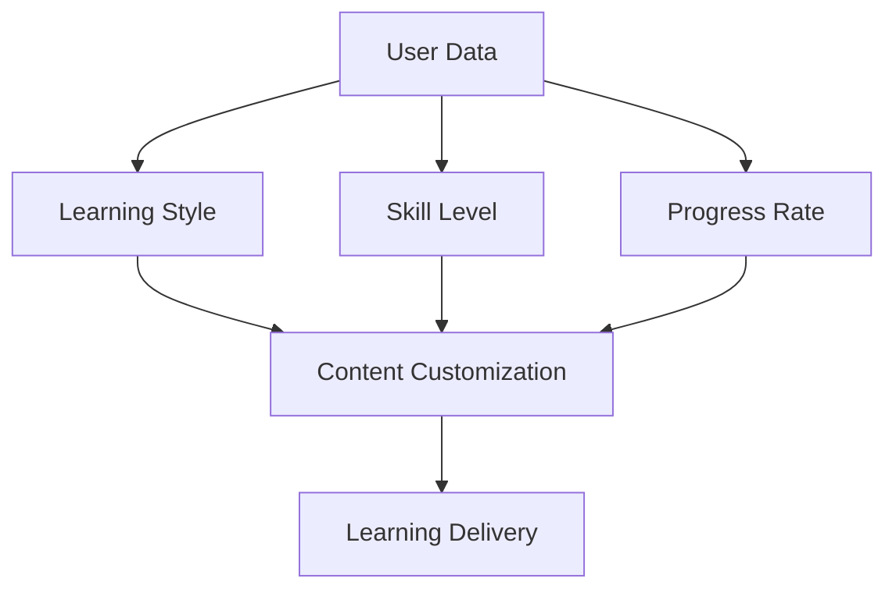

## AI Integration Points

### 1. User Interface
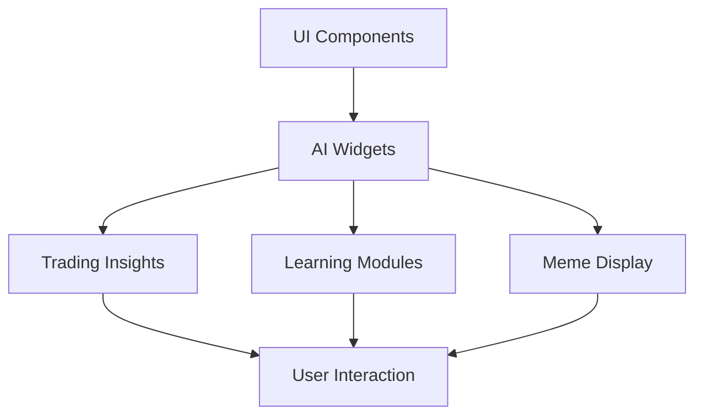

### 2. Backend Services
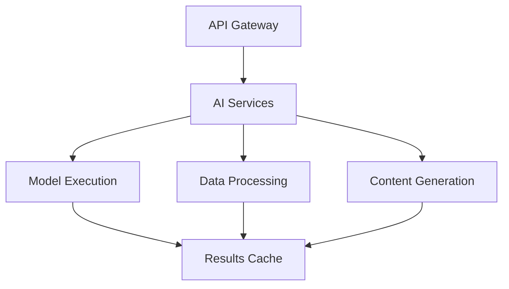

## Performance Optimization

### 1. Model Optimization
- Model compression
- Batch processing
- Caching strategies
- Load balancing

### 2. Resource Management
- GPU utilization
- Memory optimization
- Request queuing
- Error handling

## Security Measures

### 1. AI Security
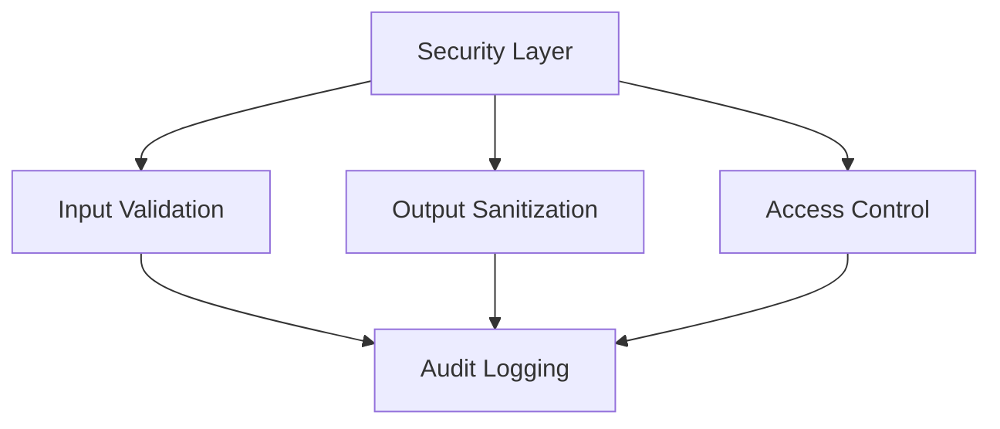

### 2. Data Protection
- Model protection
- Input validation
- Output verification
- Access controls

## Future AI Developments

### 1. Enhanced Capabilities
- Advanced prediction models
- Improved meme generation
- Better personalization
- Real-time analysis

### 2. New Features
- Automated trading
- Advanced analytics
- Social prediction
- Custom models

## Integration Guidelines

### 1. API Integration
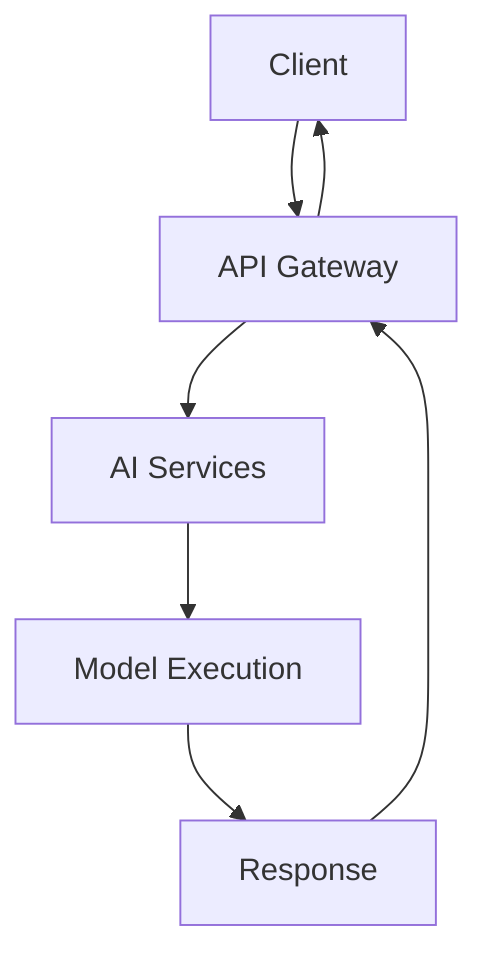

### 2. Development Flow
- Model training
- Integration testing
- Performance monitoring
- Continuous improvement

## Maintenance

### 1. Model Updates
- Regular training
- Performance monitoring
- Version control
- Rollback procedures

### 2. System Health
- Service monitoring
- Error tracking
- Performance metrics
- Resource optimization 