# AI Trading Signals

## Overview

papermemes.fun's AI signal system combines advanced machine learning models, social sentiment analysis, and market data to generate high-accuracy trading signals for memecoin trading.

## Signal Generation Architecture

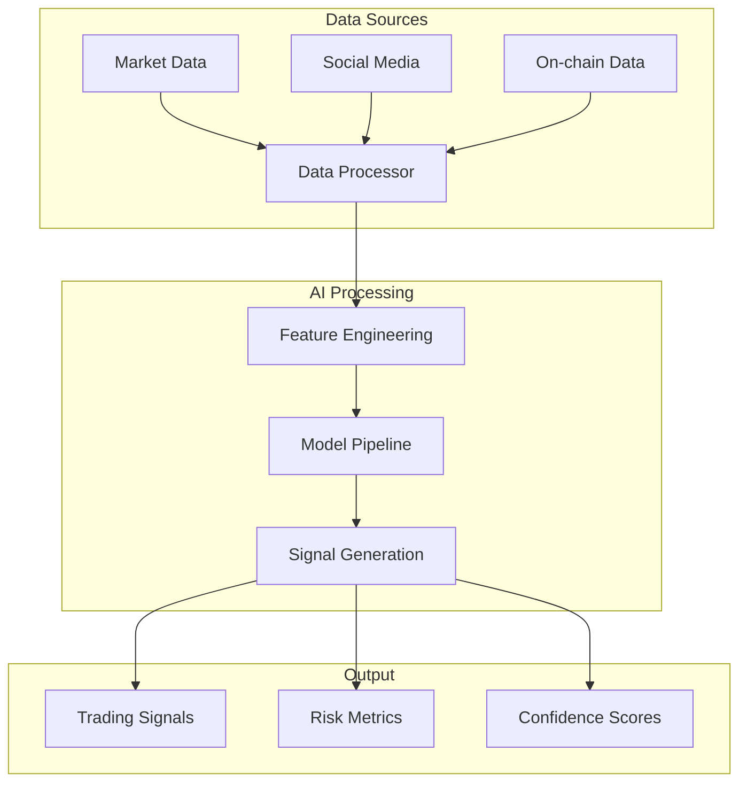

## Data Integration

### 1. Market Data Processing
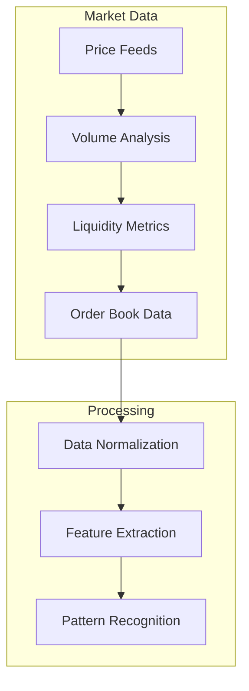

### 2. Social Sentiment Analysis
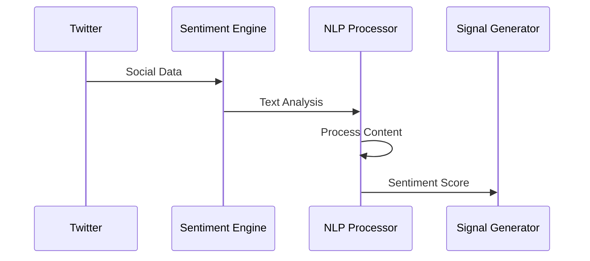

## AI Model Architecture

### 1. Model Components
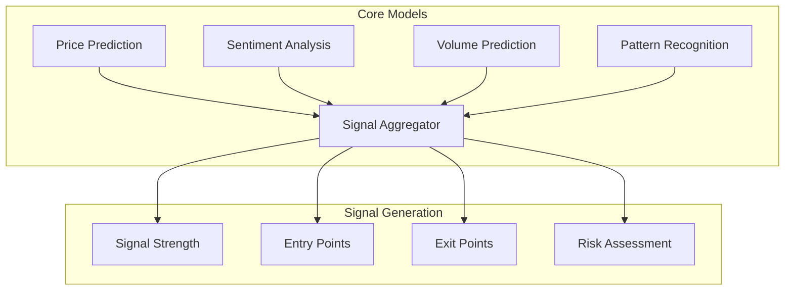

### 2. Learning System
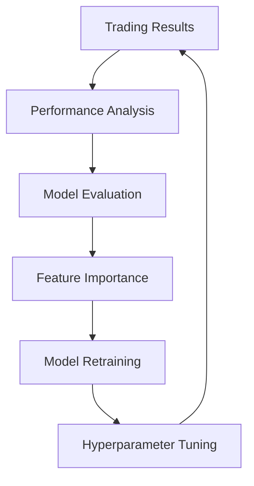

## Signal Types

### 1. Trading Signals
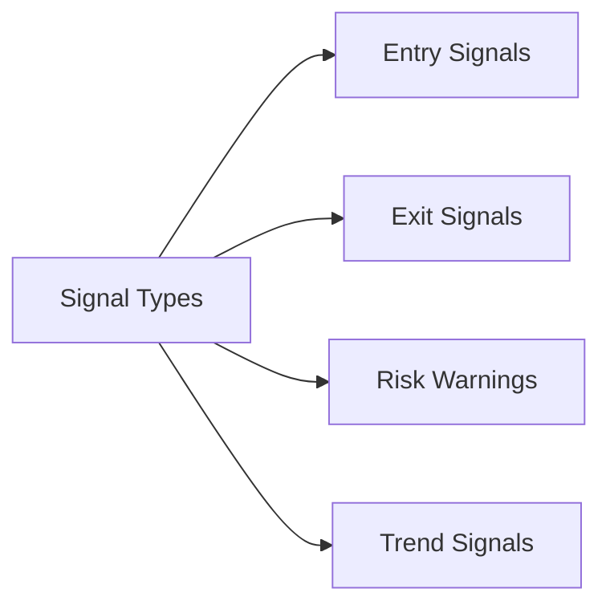

### 2. Signal Components
- Entry price targets
- Exit price targets
- Stop-loss levels
- Position sizing
- Risk metrics

## Twitter Integration

### 1. Data Collection
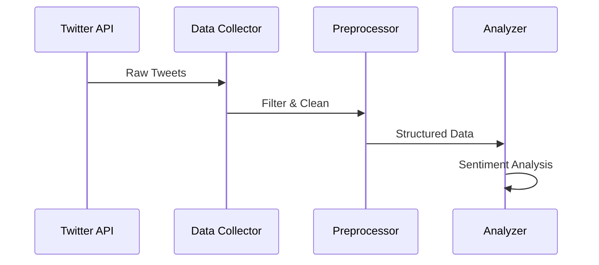

### 2. Analysis Features
- Influencer tracking
- Hashtag monitoring
- Engagement metrics
- Viral prediction
- Sentiment scoring

## Machine Learning Models

### 1. Model Architecture
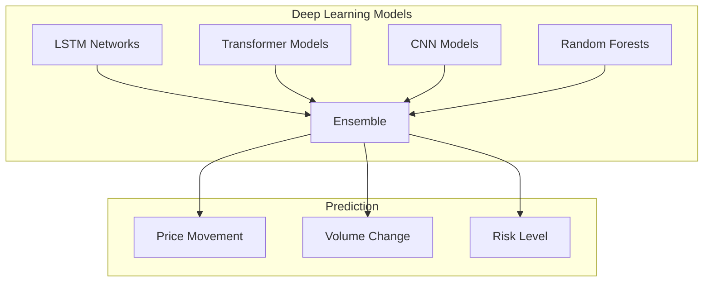

### 2. Training Process
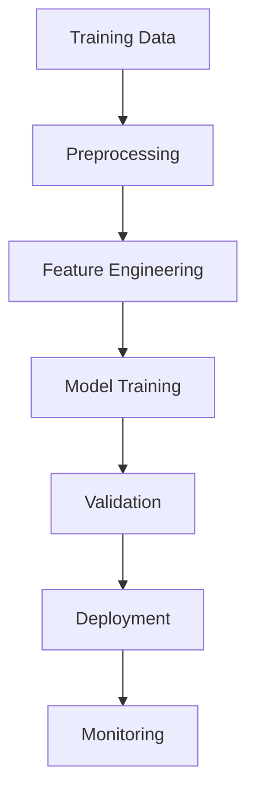

## Signal Accuracy

### 1. Performance Metrics
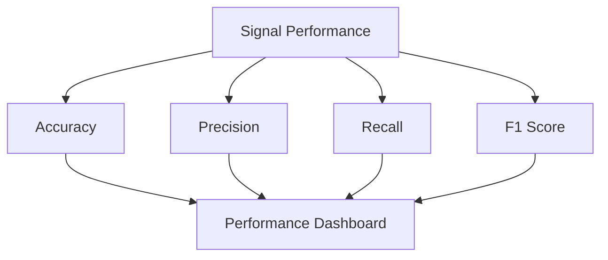

### 2. Validation System
- Backtesting framework
- Real-time validation
- Performance tracking
- Error analysis

## Implementation Details

### 1. Signal Generation
```python
class SignalGenerator:
    def generate_signal(self, market_data, social_data, chain_data):
        # Process market data
        market_features = self.process_market_data(market_data)
        
        # Process social sentiment
        sentiment_score = self.analyze_sentiment(social_data)
        
        # Process on-chain data
        chain_metrics = self.analyze_chain_data(chain_data)
        
        # Generate signal
        signal = self.model.predict(market_features, sentiment_score, chain_metrics)
        
        return self.format_signal(signal)
```

### 2. Model Training
```python
class ModelTrainer:
    def train_model(self, training_data):
        # Preprocess data
        features = self.prepare_features(training_data)
        
        # Train model
        self.model.fit(
            features,
            validation_split=0.2,
            callbacks=[
                EarlyStopping(patience=5),
                ModelCheckpoint('best_model.h5')
            ]
        )
```

## Real-time Processing

### 1. Data Flow
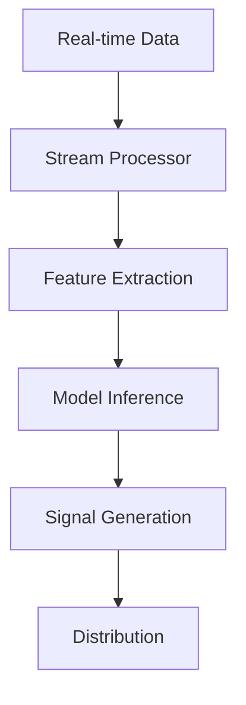

### 2. Performance
- Processing latency: <50ms
- Update frequency: Real-time
- Signal delivery: Instant
- Scalability: Horizontal

## Risk Management

### 1. Risk Assessment
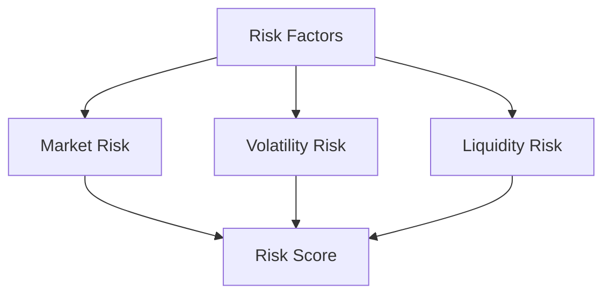

### 2. Protection Measures
- Position size limits
- Risk-based filtering
- Confidence thresholds
- Exposure management

## Future Enhancements

### 1. Technical Roadmap
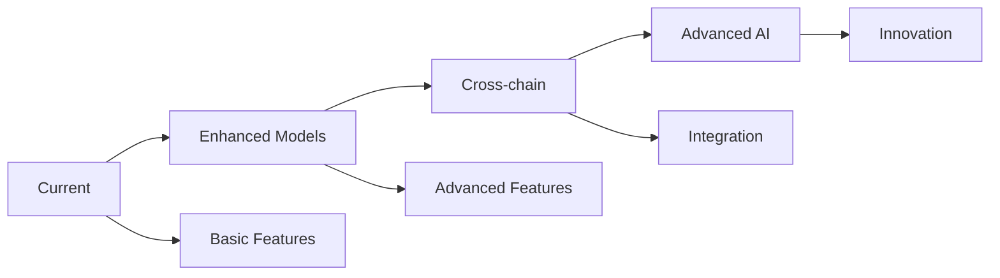

### 2. Planned Features
- Advanced neural networks
- Quantum computing integration
- Enhanced social analysis
- Cross-chain signals

## Performance Metrics

### 1. Signal Performance
- Accuracy: >85%
- Precision: >80%
- Recall: >75%
- F1 Score: >82%

### 2. System Performance
- Latency: <50ms
- Throughput: 10k signals/second
- Availability: 99.99%
- Reliability: 99.9% 