# DEX Architecture

## Overview

papermemes.fun's DEX represents a breakthrough in Solana-based decentralized exchanges, combining AI-powered trading signals, high-performance execution, and memecoin-focused features.

## DEX Architecture

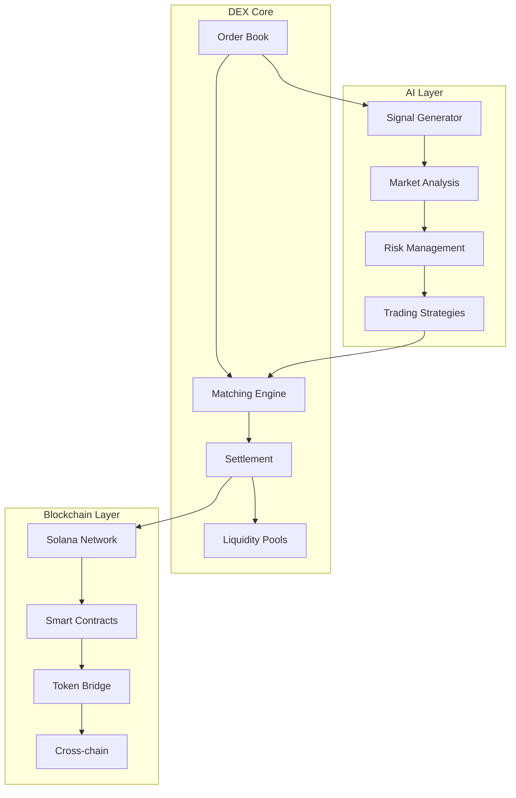

## High-Performance Infrastructure

### 1. Network Architecture
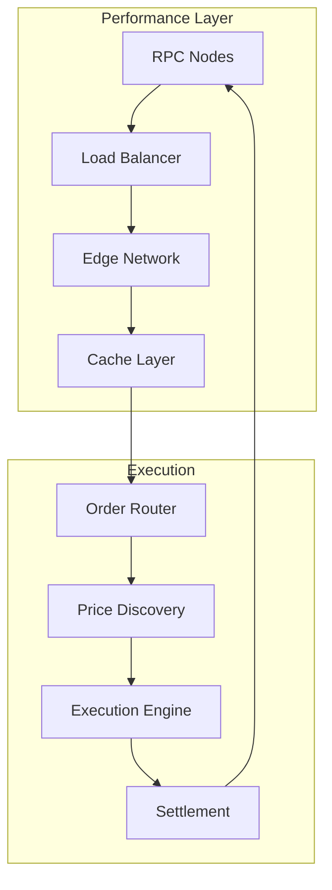

### 2. Performance Metrics
- Sub-second transaction confirmation
- 65,000 TPS capability
- 400ms average execution time
- 99.99% uptime guarantee

## AI Signal System

### 1. Signal Generation Flow
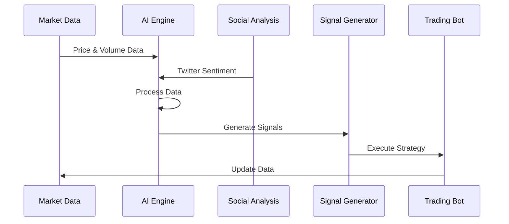

### 2. AI Model Components
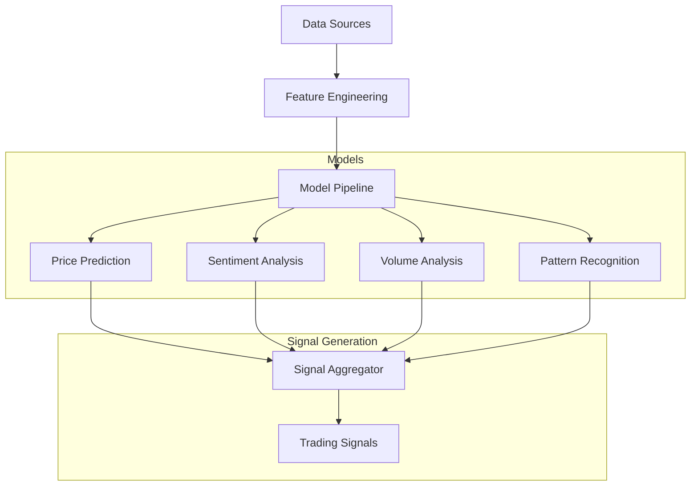

## Trading Bot Architecture

### 1. Bot Components
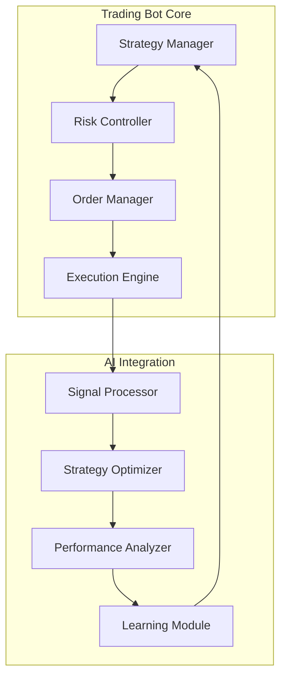

### 2. Learning System
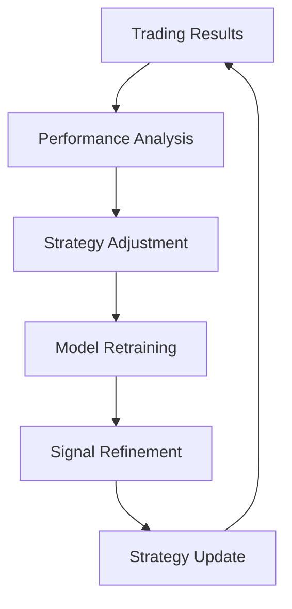

## Social Integration

### 1. Twitter API Integration
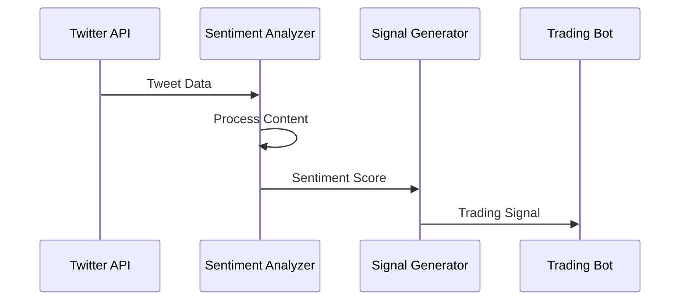

### 2. Social Metrics Analysis
- Real-time sentiment tracking
- Influencer impact analysis
- Trend detection
- Viral prediction

## Memecoin Features

### 1. Token Analysis
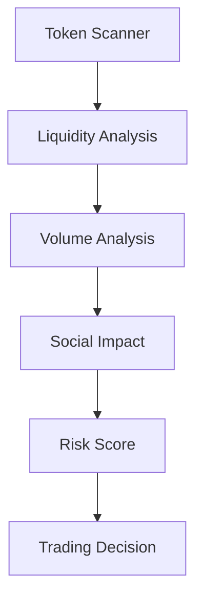

### 2. Specialized Features
- Memecoin-specific indicators
- Community sentiment tracking
- Viral potential analysis
- Risk management tools

## Performance Optimization

### 1. Execution Optimization
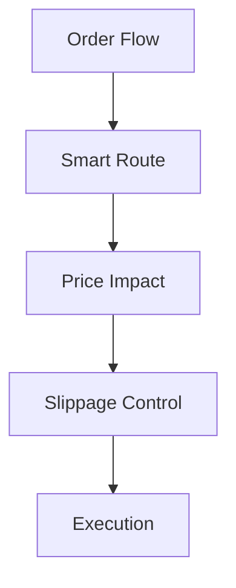

### 2. Infrastructure
- Dedicated RPC nodes
- Global edge network
- Advanced caching
- Load balancing

## Risk Management

### 1. Risk Controls
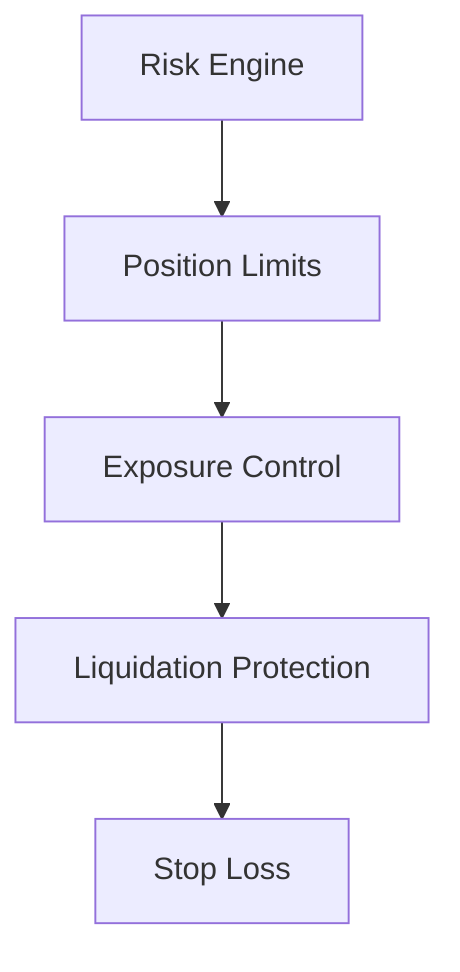

### 2. Protection Features
- Smart contract insurance
- Automated risk adjustment
- Liquidation protection
- Multi-sig security

## AI Learning System

### 1. Model Improvement
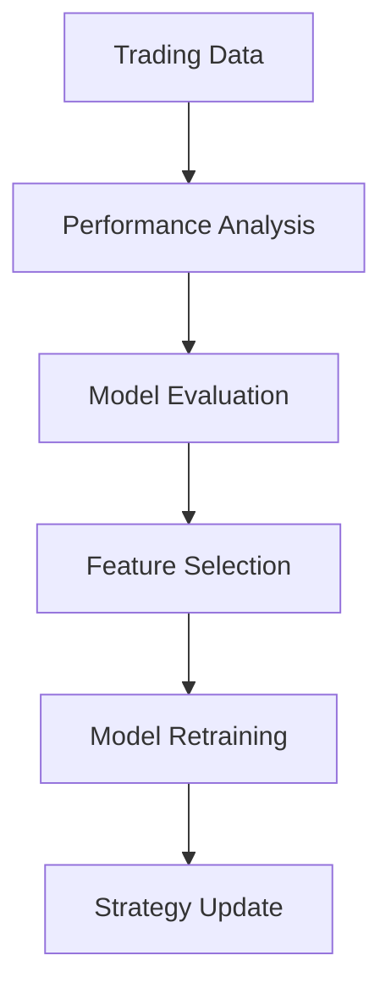

### 2. Learning Process
- Continuous model training
- Performance feedback loops
- Strategy optimization
- Risk adjustment

## Implementation Details

### 1. Smart Contracts
```solidity
// Example Solana Program
#[program]
pub mod dex {
    use super::*;

    pub fn initialize_market(
        ctx: Context<InitializeMarket>,
        market_info: MarketInfo
    ) -> Result<()> {
        // Market initialization logic
    }

    pub fn place_order(
        ctx: Context<PlaceOrder>,
        order_info: OrderInfo
    ) -> Result<()> {
        // Order placement logic
    }
}
```

### 2. Trading Bot Implementation
```typescript
class TradingBot {
    async processSignal(signal: Signal) {
        const strategy = await this.strategyManager.getStrategy(signal);
        const riskCheck = await this.riskController.evaluate(strategy);
        
        if (riskCheck.approved) {
            const order = await this.orderManager.createOrder(strategy);
            return this.executionEngine.execute(order);
        }
    }
}
```

## Competitive Advantages

### 1. Technical Benefits
- Fastest execution on Solana
- AI-powered trading signals
- Advanced risk management
- Low transaction fees

### 2. Feature Benefits
- First client-side trading bot
- Memecoin specialization
- Social sentiment integration
- Learning AI system

## Future Developments

### 1. Technical Roadmap
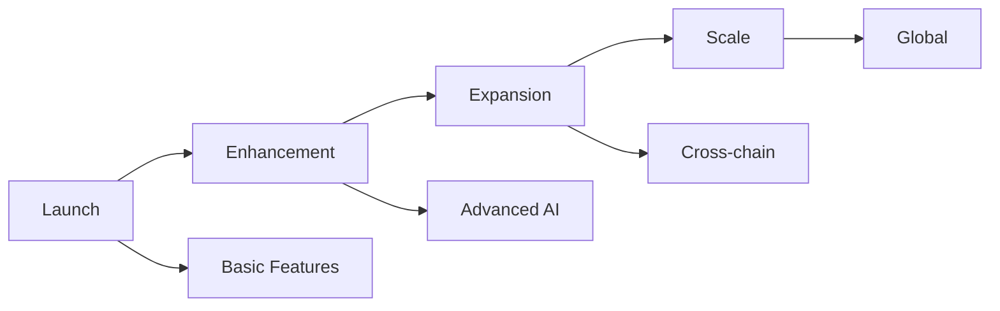

### 2. Feature Roadmap
- Advanced trading algorithms
- Cross-chain integration
- Enhanced AI models
- Mobile trading bot

## Performance Metrics

### 1. System Performance
- Transaction speed: <400ms
- Slippage: <0.1%
- Uptime: 99.99%
- Node distribution: Global

### 2. AI Performance
- Signal accuracy: >85%
- Learning rate: Daily updates
- Model confidence: >90%
- Response time: <100ms 