# Security

## Overview

papermemes.fun implements comprehensive security measures to protect user data, ensure platform integrity, and maintain a safe trading environment.

## Security Architecture

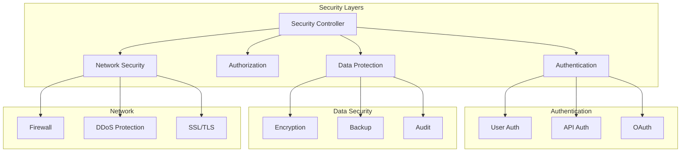

## Security Components

### 1. Authentication System
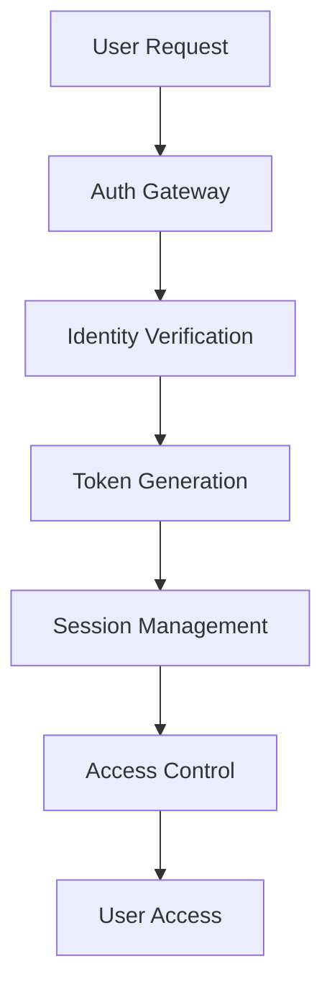

### 2. Data Protection
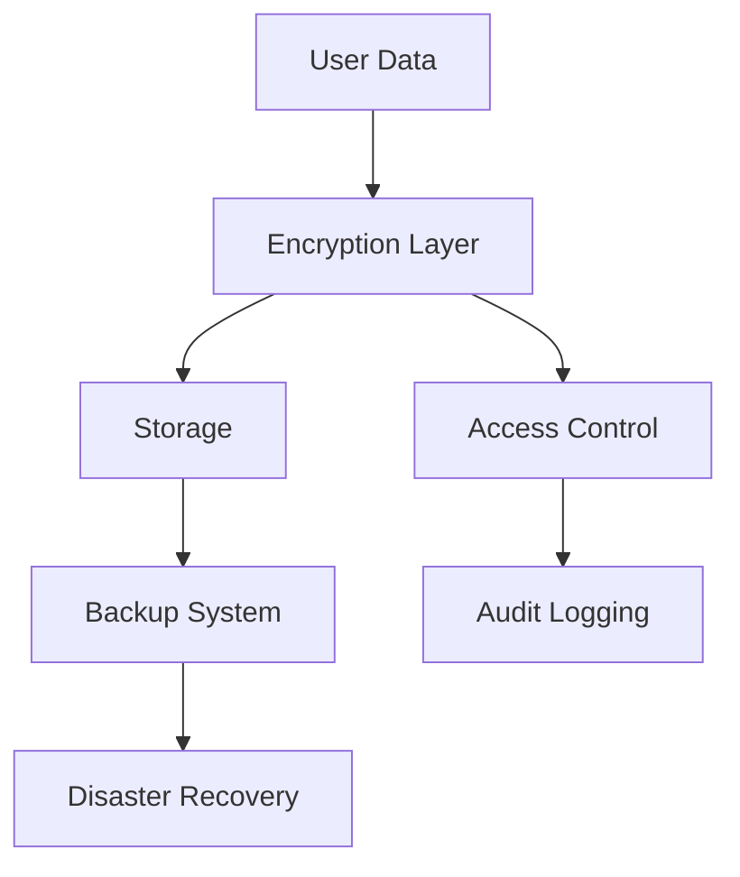

## Security Flows

### Authentication Flow
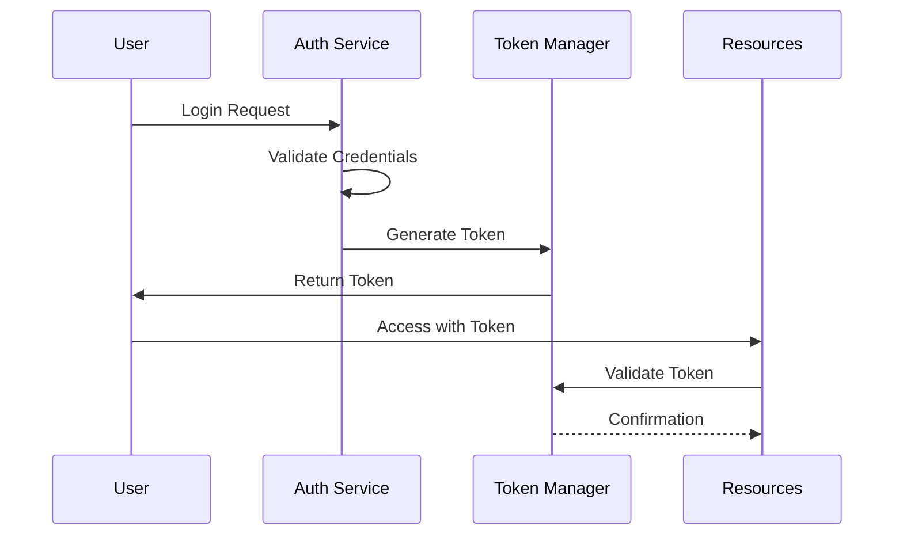

### Data Access Flow
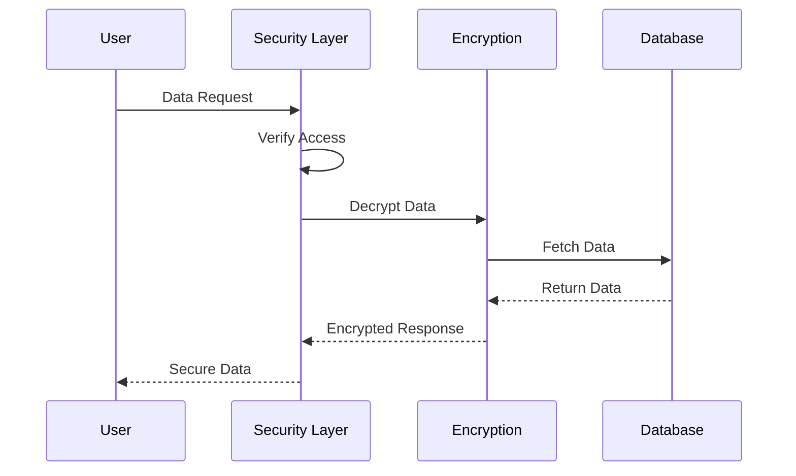

## Security Features

### 1. Authentication & Authorization
- **User Authentication**
  - Multi-factor authentication
  - Biometric support
  - Session management
  - Password policies

- **Access Control**
  - Role-based access
  - Permission management
  - API authentication
  - OAuth integration

### 2. Data Security
- **Encryption**
  - End-to-end encryption
  - At-rest encryption
  - Key management
  - Secure storage

- **Data Protection**
  - Regular backups
  - Data masking
  - Secure deletion
  - Version control

### 3. Network Security
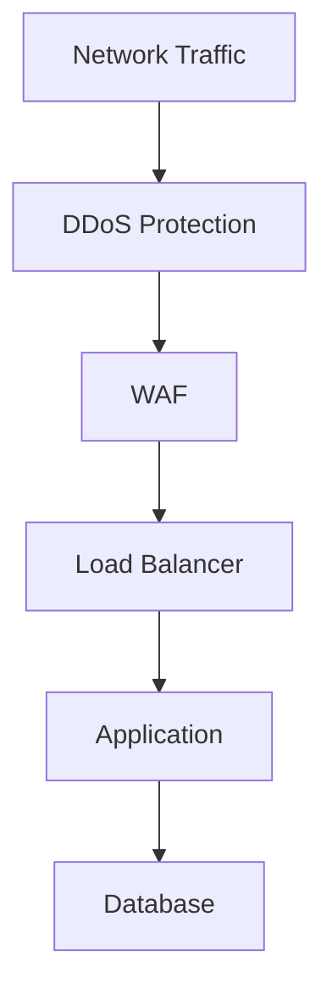

## Monitoring & Compliance

### 1. Security Monitoring
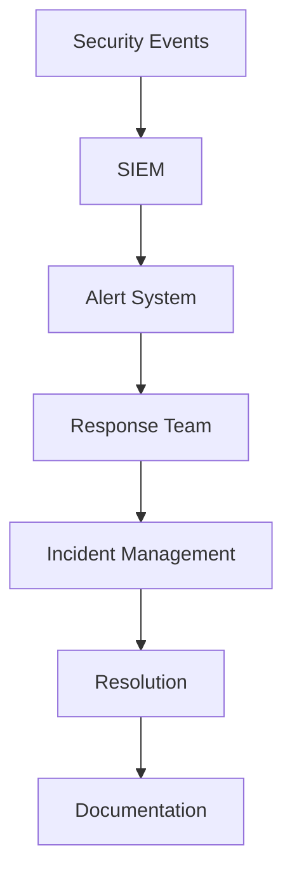

### 2. Compliance
- GDPR compliance
- Data privacy
- Regulatory requirements
- Security standards

## Incident Response

### 1. Response Protocol
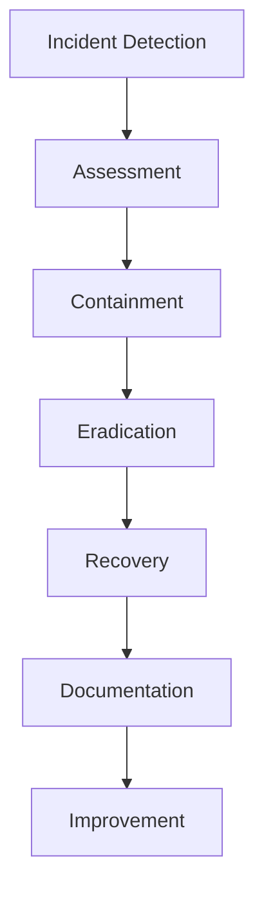

### 2. Recovery Procedures
- Incident classification
- Response procedures
- Communication plan
- Recovery steps

## Security Testing

### 1. Testing Framework
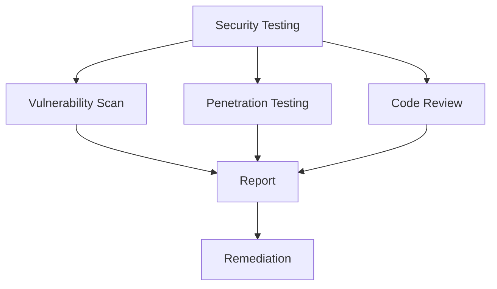

### 2. Regular Assessments
- Security audits
- Vulnerability scanning
- Penetration testing
- Code reviews

## Access Control

### 1. User Access
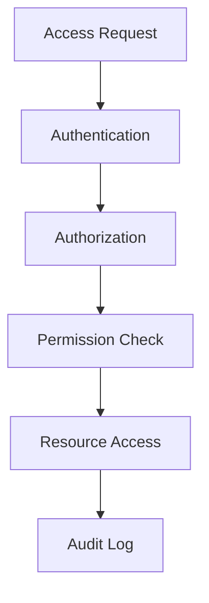

### 2. API Security
- API keys
- Rate limiting
- Request validation
- Response security

## Data Privacy

### 1. Privacy Controls
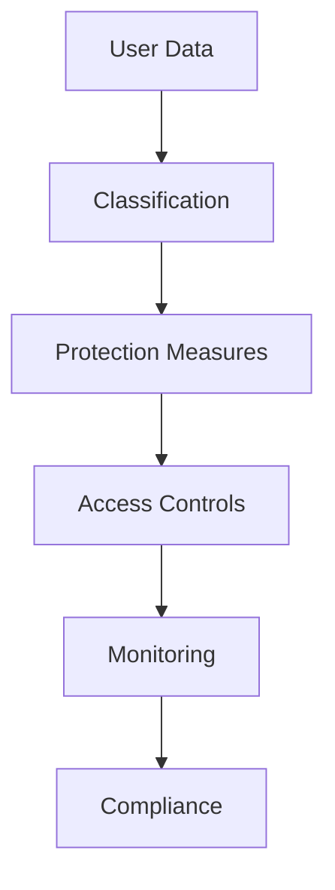

### 2. Data Handling
- Data minimization
- Retention policies
- Secure disposal
- Privacy by design

## Security Infrastructure

### 1. Infrastructure Security
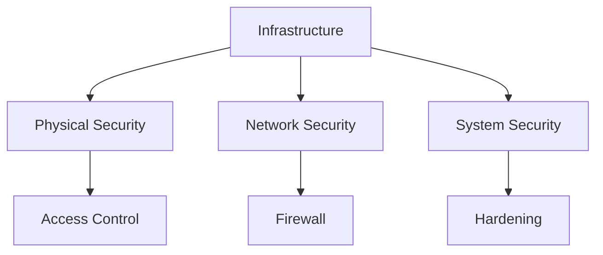

### 2. Cloud Security
- Cloud provider security
- Container security
- Serverless security
- Storage security

## Continuous Security

### 1. Security Pipeline
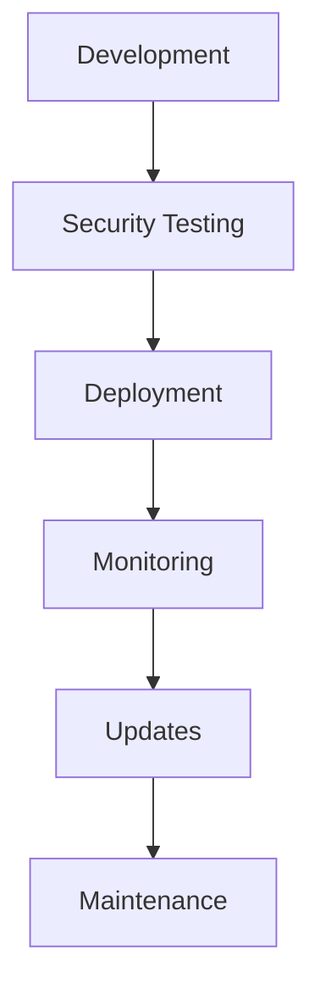

### 2. Security Updates
- Patch management
- Version control
- Dependency updates
- Security fixes

## Documentation & Training

### 1. Security Documentation
- Security policies
- Procedures
- Guidelines
- Best practices

### 2. Security Training
- User awareness
- Staff training
- Security updates
- Incident response 