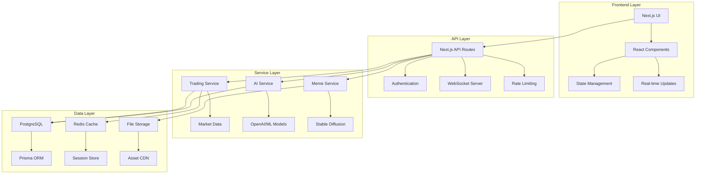
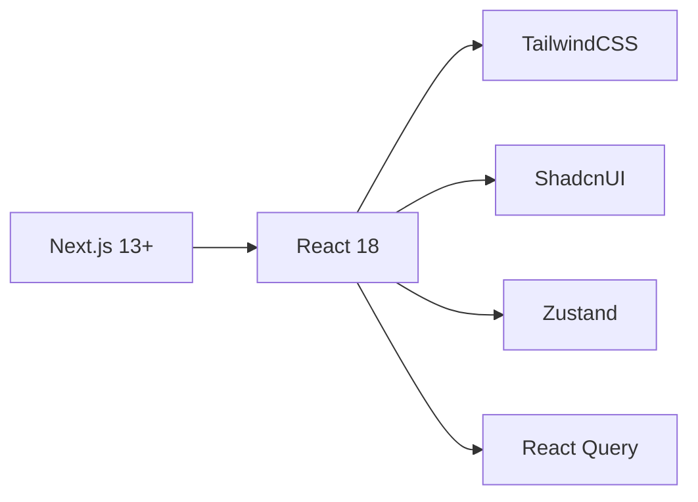
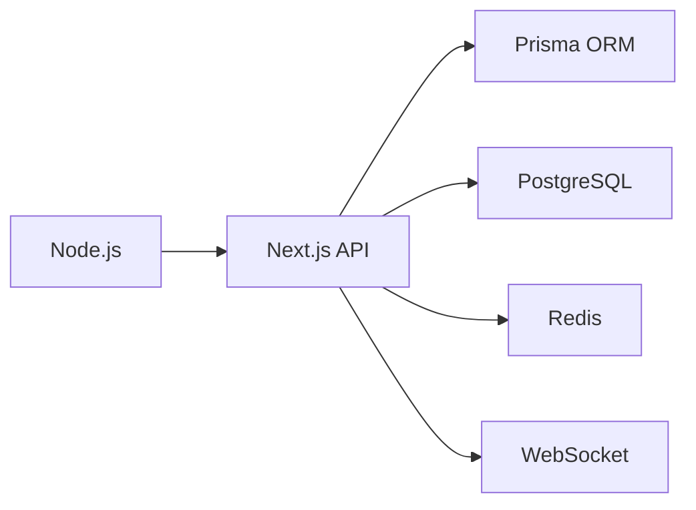
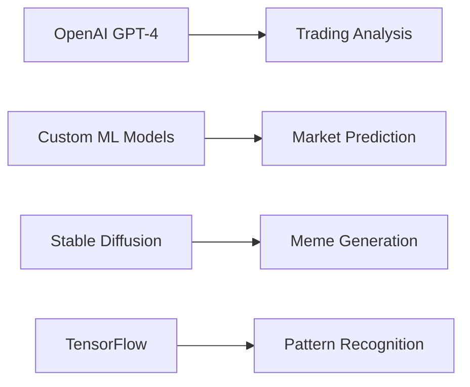
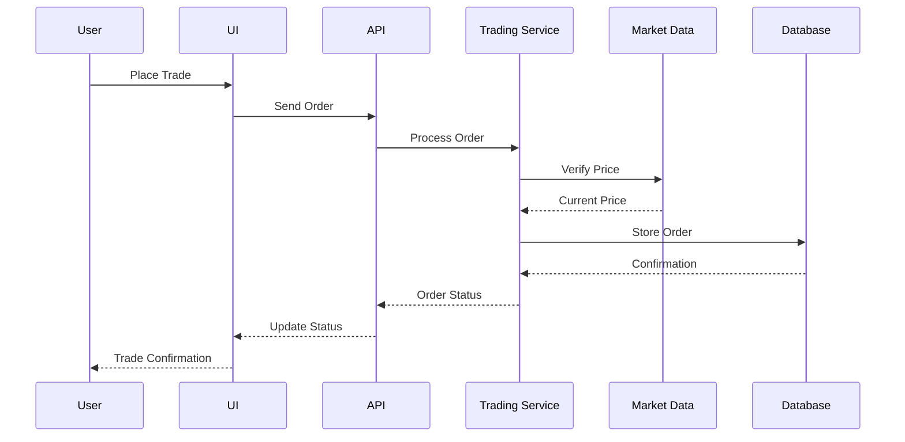
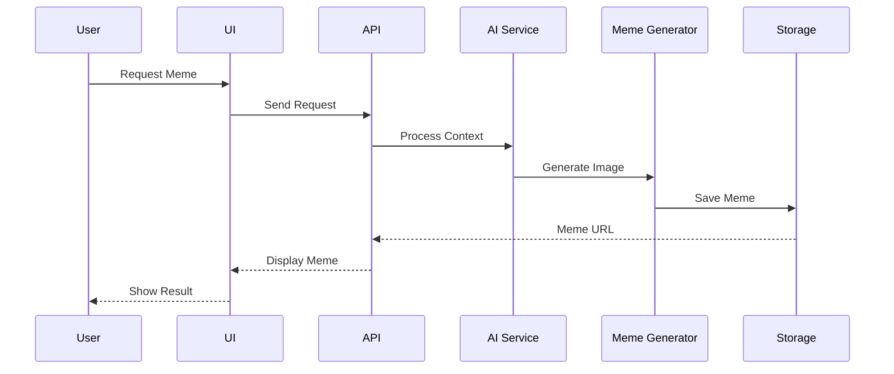
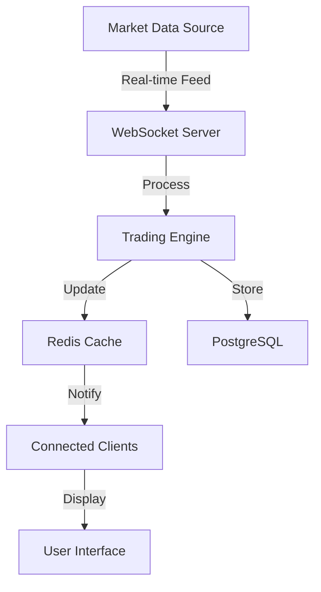
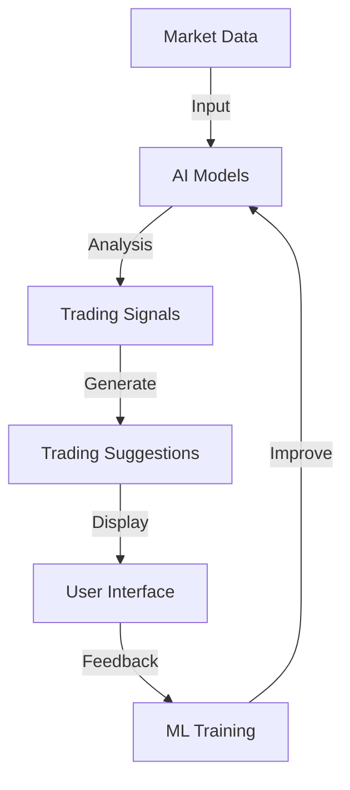
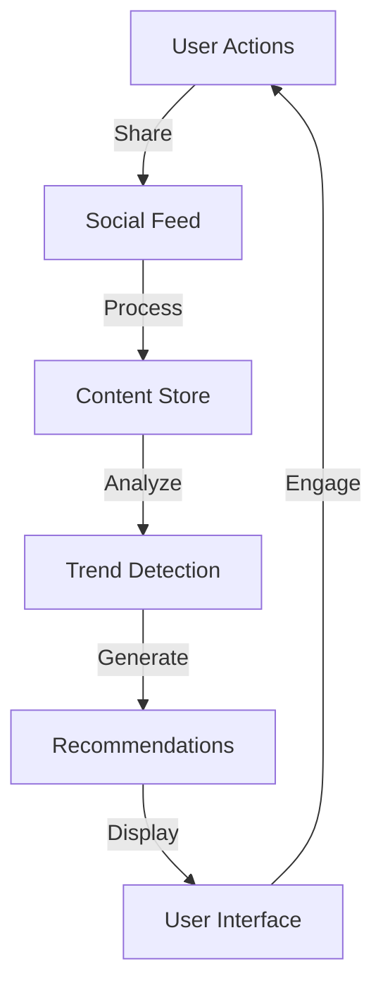

# Technology Stack

## Overview

papermemes.fun leverages cutting-edge technologies to deliver a seamless, scalable, and engaging trading experience.

## System Architecture Diagram

## Core Technologies

### Frontend Stack

### Backend Stack

### AI Integration Stack

## Data Flow Architecture

### Trading Data Flow

### Meme Generation Flow

## Technology Components

### 1. Frontend Technologies
- **Next.js 13+**
  - App Router for routing
  - Server Components
  - Client Components
  - API Routes

- **React Ecosystem**
  - React 18
  - React Query
  - React Hook Form
  - React Testing Library

- **Styling**
  - TailwindCSS
  - ShadcnUI
  - CSS Modules
  - PostCSS

### 2. Backend Technologies
- **Server Framework**
  - Node.js
  - Next.js API Routes
  - Express.js middleware

- **Database**
  - PostgreSQL
  - Prisma ORM
  - Connection Pooling
  - Migrations

- **Caching**
  - Redis
  - In-memory caching
  - CDN caching
  - Browser caching

### 3. AI Technologies
- **Trading Analysis**
  - OpenAI GPT-4
  - Custom ML Models
  - TensorFlow
  - PyTorch

- **Meme Generation**
  - Stable Diffusion
  - DALL-E
  - Custom Templates
  - Image Processing

### 4. DevOps & Infrastructure
- **Deployment**
  - Docker
  - Kubernetes
  - Vercel
  - GitHub Actions

- **Monitoring**
  - Prometheus
  - Grafana
  - Sentry
  - LogDNA

## Data Processing Loops

### 1. Market Data Loop

### 2. AI Trading Loop

### 3. Social Trading Loop

## Performance Considerations

### 1. Data Processing
- Batch processing for heavy computations
- Stream processing for real-time data
- Caching strategies for frequent requests
- Background job processing

### 2. Scalability
- Horizontal scaling for services
- Database sharding
- Load balancing
- CDN distribution

### 3. Optimization
- Code splitting
- Lazy loading
- Asset optimization
- Query optimization

## Integration Points

### 1. External APIs
- Cryptocurrency exchanges
- Market data providers
- Payment processors
- Social media platforms

### 2. Internal Services
- Authentication service
- Trading engine
- AI services
- Content delivery

## Future Technology Roadmap

### 1. Short-term
- Mobile app development
- Advanced AI models
- Enhanced meme generation
- Improved real-time features

### 2. Long-term
- Blockchain integration
- Decentralized features
- Advanced ML capabilities
- Extended platform support 