# Trading Bot System

## Overview

papermemes.fun's trading bot represents the first client-side AI-powered trading system on the Solana blockchain, specifically optimized for memecoin trading with institutional-grade execution speed and security.

## System Architecture

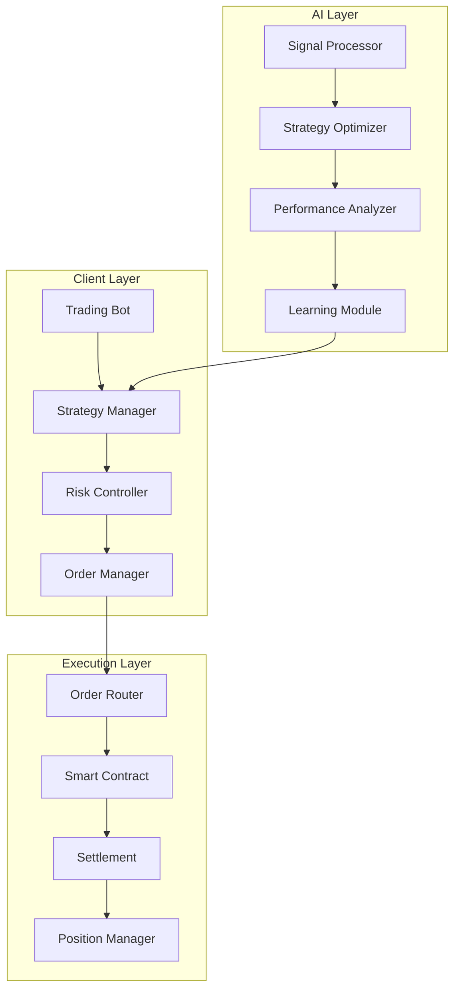

## Client-Side Architecture

### 1. Component Structure
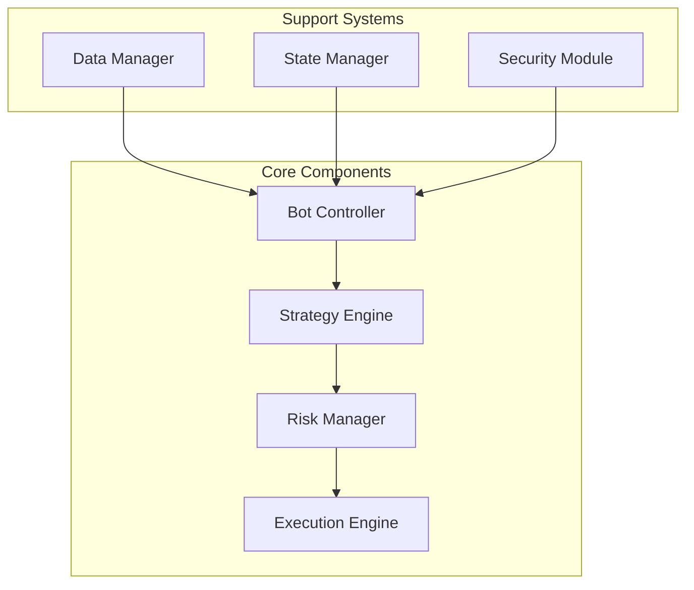

### 2. Data Flow
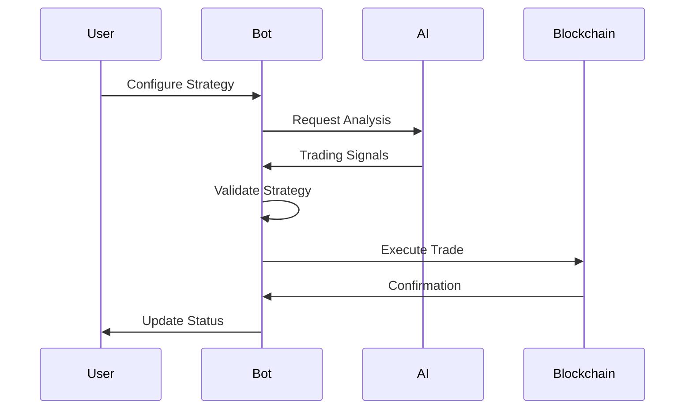

## Trading Features

### 1. Strategy Components
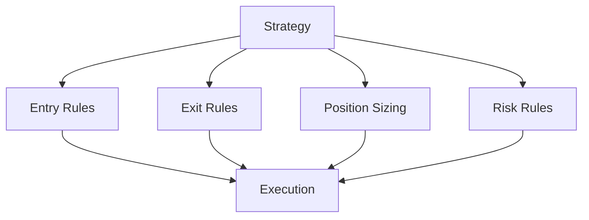

### 2. Advanced Features
- Smart order routing
- Slippage protection
- MEV protection
- Gas optimization

## AI Integration

### 1. Signal Processing
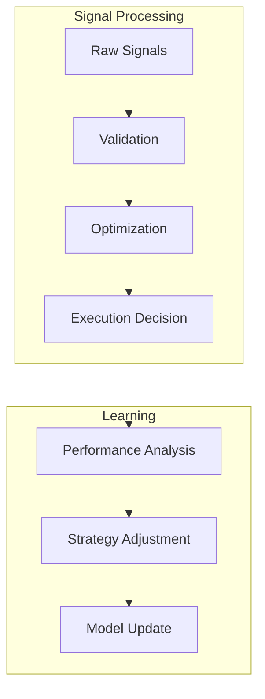

### 2. Learning System
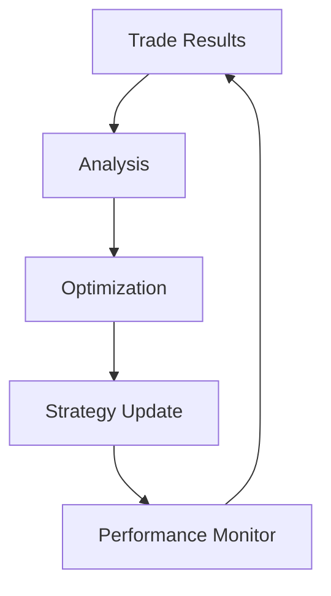

## Performance Optimization

### 1. Execution Speed
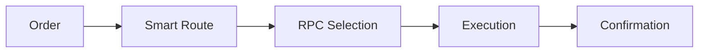

### 2. Optimization Features
- Dynamic RPC selection
- Parallel order processing
- Optimized contract calls
- Memory management

## Risk Management

### 1. Risk Controls
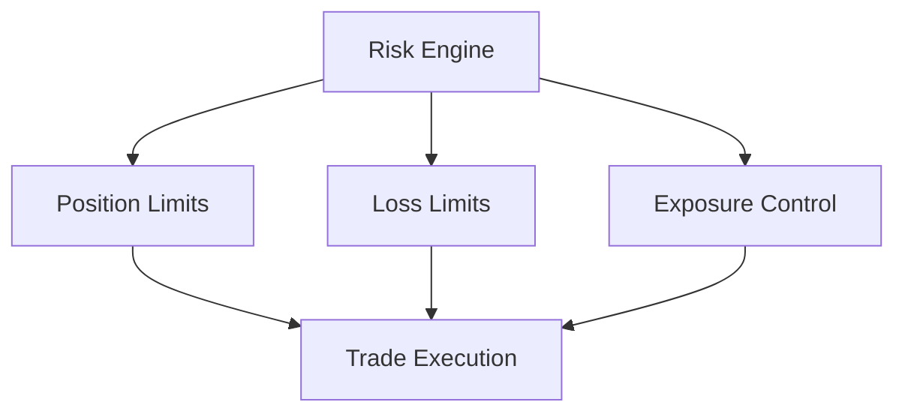

### 2. Protection Measures
- Smart contract validation
- Transaction simulation
- Slippage protection
- Error recovery

## Implementation Details

### 1. Bot Implementation
```typescript
class TradingBot {
    private strategyManager: StrategyManager;
    private riskController: RiskController;
    private orderManager: OrderManager;
    private executionEngine: ExecutionEngine;

    async executeTrade(signal: Signal): Promise<TradeResult> {
        // Validate signal
        if (!this.validateSignal(signal)) {
            return { success: false, reason: 'Invalid signal' };
        }

        // Check risk limits
        const riskCheck = await this.riskController.checkLimits(signal);
        if (!riskCheck.approved) {
            return { success: false, reason: riskCheck.reason };
        }

        // Generate order
        const order = await this.orderManager.createOrder(signal);
        
        // Execute trade
        return this.executionEngine.execute(order);
    }

    private validateSignal(signal: Signal): boolean {
        // Signal validation logic
        return true;
    }
}
```

### 2. Strategy Implementation
```typescript
class StrategyManager {
    async evaluateStrategy(signal: Signal): Promise<Strategy> {
        const marketConditions = await this.getMarketConditions();
        const riskProfile = await this.getRiskProfile();
        
        return {
            entryPrice: this.calculateEntry(signal, marketConditions),
            exitPrice: this.calculateExit(signal, marketConditions),
            positionSize: this.calculatePosition(signal, riskProfile),
            stopLoss: this.calculateStopLoss(signal, riskProfile)
        };
    }
}
```

## Solana Integration

### 1. Blockchain Integration
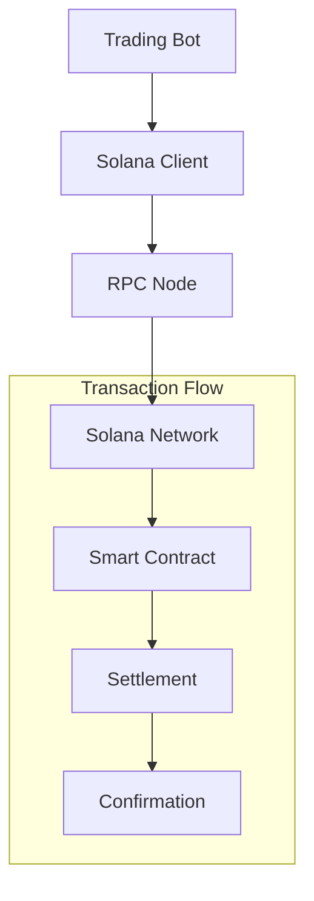

### 2. Smart Contract Interaction
```typescript
class SolanaExecutionEngine {
    async executeTransaction(instruction: TransactionInstruction): Promise<string> {
        const transaction = new Transaction().add(instruction);
        
        // Sign and send transaction
        const signature = await this.sendAndConfirmTransaction(transaction);
        
        // Monitor transaction
        return this.monitorTransaction(signature);
    }
}
```

## Performance Metrics

### 1. Execution Metrics
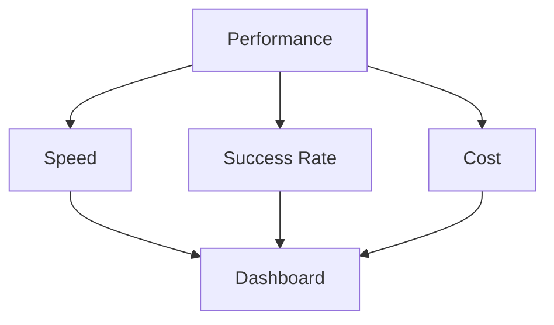

### 2. Key Metrics
- Execution speed: <200ms
- Success rate: >99.5%
- Gas optimization: 30% savings
- Slippage: <0.1%

## Security Features

### 1. Security Architecture
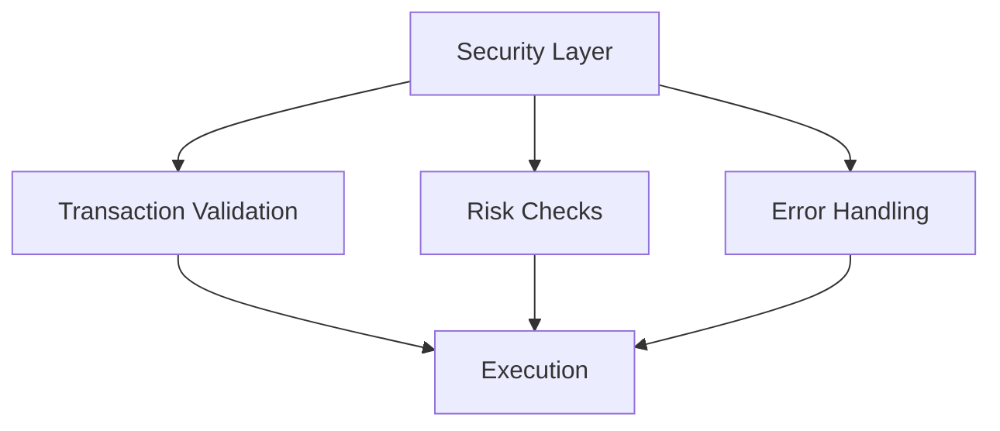

### 2. Protection Measures
- Private key encryption
- Secure RPC connections
- Transaction validation
- Error recovery

## Future Development

### 1. Roadmap
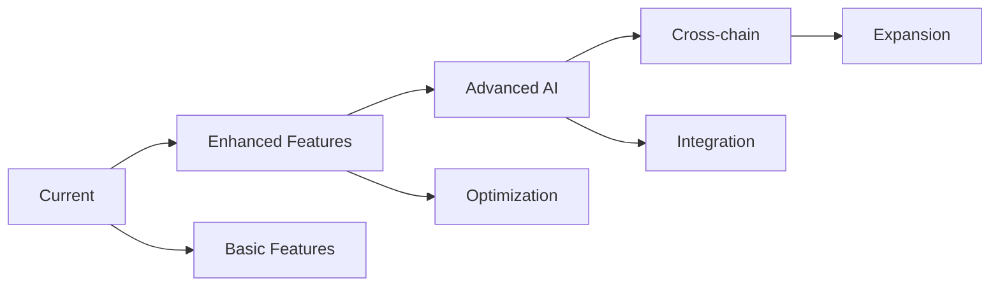

### 2. Planned Features
- Advanced trading algorithms
- Cross-chain integration
- Enhanced AI models
- Mobile integration

## System Requirements

### 1. Hardware Requirements
- CPU: 4+ cores
- RAM: 8GB+
- Storage: 100GB SSD
- Network: High-speed internet

### 2. Software Requirements
- Node.js 18+
- Solana CLI
- System dependencies
- Security certificates

## Monitoring & Maintenance

### 1. Monitoring System
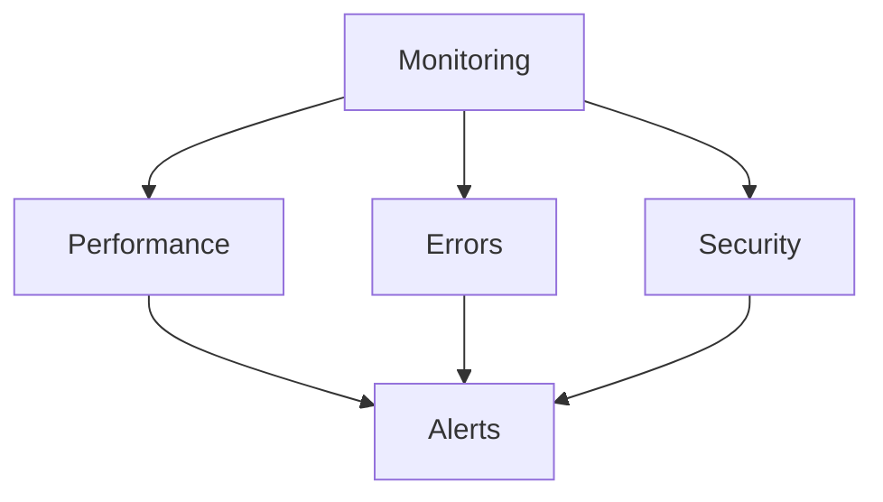

### 2. Maintenance
- Regular updates
- Performance optimization
- Security patches
- Backup systems 