# Trading Features

## Platform Overview

papermemes.fun provides a comprehensive suite of trading features designed to simulate real cryptocurrency trading while maintaining an engaging and educational environment.

## Trading Interface Architecture

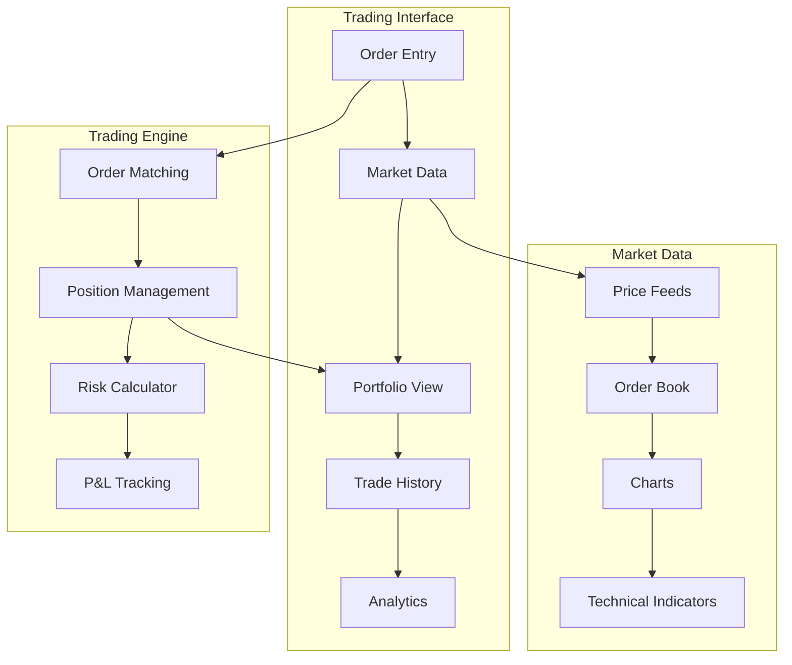

## Core Trading Features

### 1. Order Types
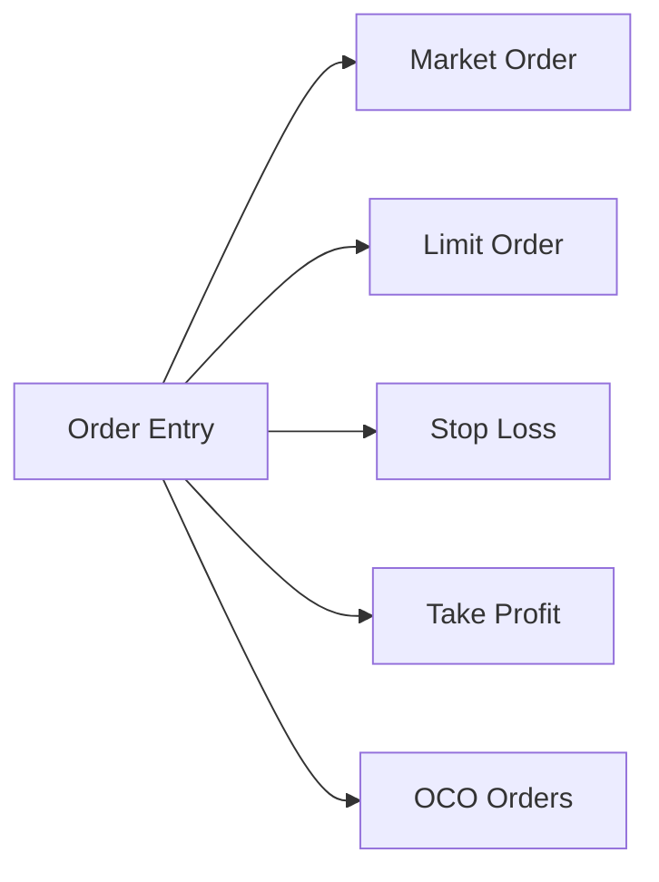

### 2. Position Management
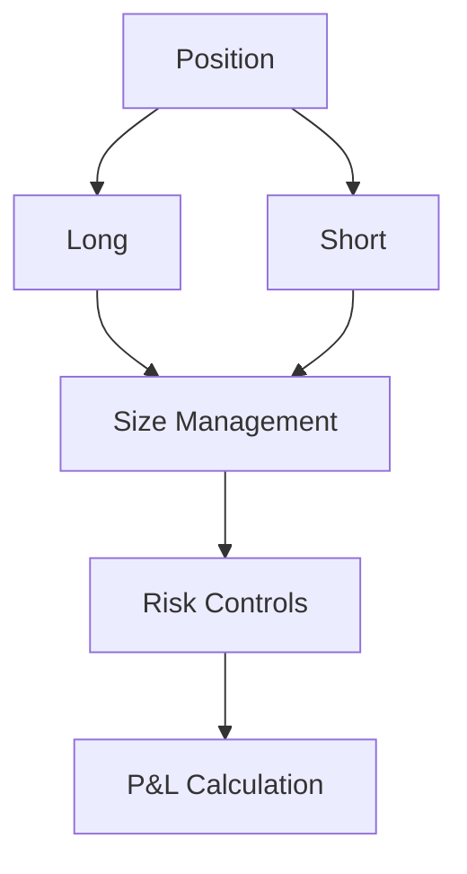

## Trading Process Flow

### Order Execution Flow
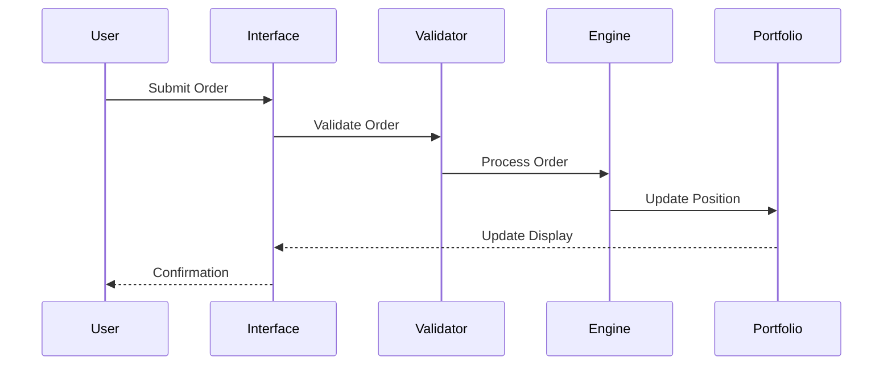

### Risk Management Flow
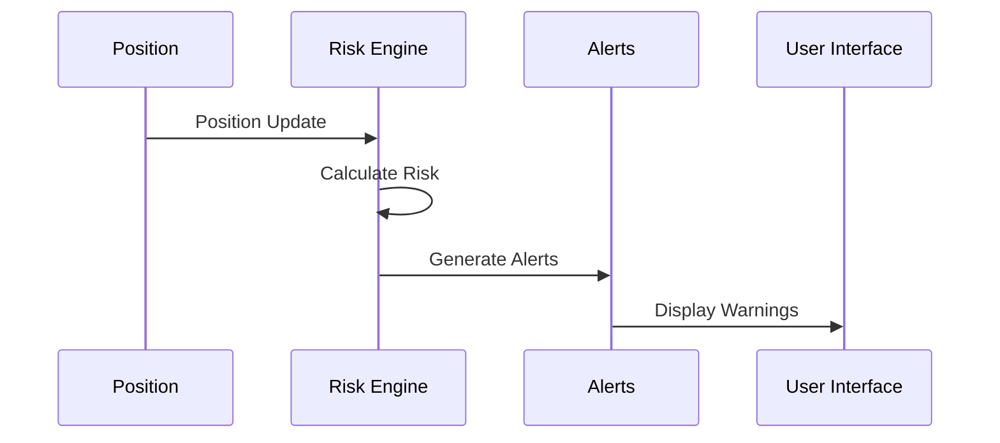

## Feature Components

### 1. Market Data Display
- **Real-time Price Feeds**
  - Cryptocurrency pairs
  - Market depth
  - Trade history
  - Volume data

- **Technical Analysis**
  - Multiple chart types
  - Technical indicators
  - Drawing tools
  - Pattern recognition

### 2. Order Management
- **Order Types**
  - Market orders
  - Limit orders
  - Stop orders
  - OCO (One-Cancels-Other)

- **Position Controls**
  - Position sizing
  - Risk parameters
  - Take profit
  - Stop loss

### 3. Portfolio Management
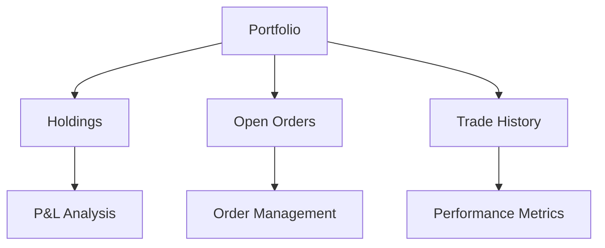

### 4. Risk Management
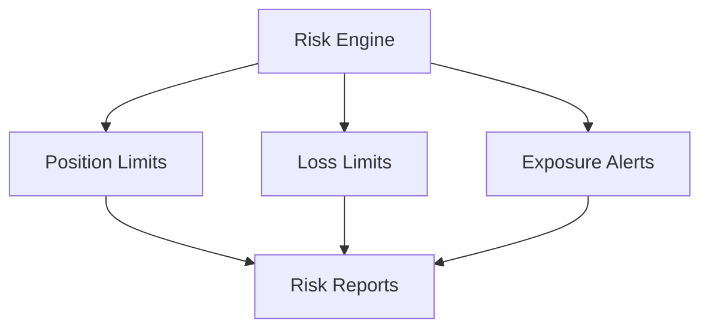

## Educational Integration

### 1. Learning Features
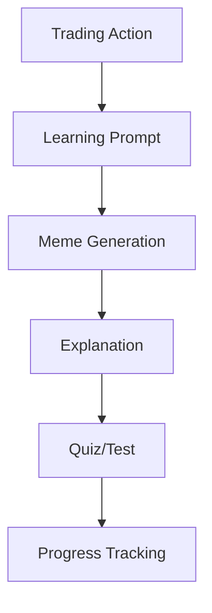

### 2. Social Trading
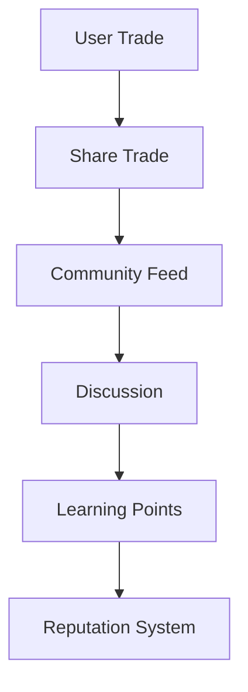

## Performance Analytics

### 1. Trading Metrics
- Win/Loss ratio
- Average profit/loss
- Risk-adjusted returns
- Maximum drawdown

### 2. Learning Progress
- Completed lessons
- Quiz scores
- Trading improvements
- Skill assessments

## Risk Controls

### 1. Position Limits
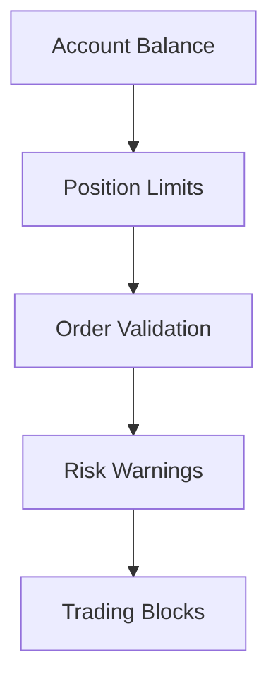

### 2. Loss Prevention
- Maximum position size
- Daily loss limits
- Volatility adjustments
- Automatic stop-loss

## Mobile Trading Features

### 1. Mobile Interface
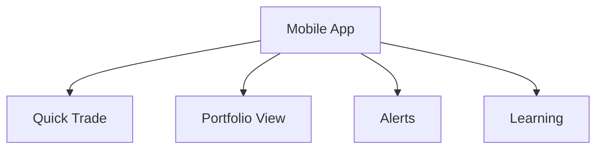

### 2. Mobile Specific
- Push notifications
- Quick order entry
- Biometric security
- Offline mode

## Future Enhancements

### 1. Advanced Features
- Algorithmic trading
- Custom indicators
- Advanced order types
- Portfolio optimization

### 2. Integration Plans
- Multiple exchanges
- Additional assets
- Enhanced analytics
- AI trading bots

## Paper Trading Benefits

### 1. Risk-Free Learning
- Practice without losses
- Strategy testing
- Confidence building
- Skill development

### 2. Educational Value
- Real market conditions
- Immediate feedback
- Performance tracking
- Guided learning

## Platform Security

### 1. Trading Security
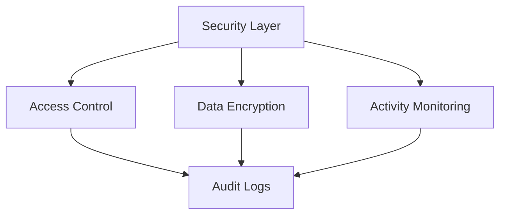

### 2. Data Protection
- User data encryption
- Secure communications
- Regular backups
- Access controls 